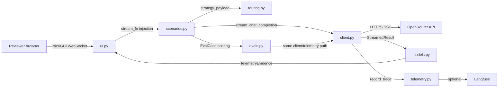

# Phase 6: Interview Walkthrough and Quality Gates - Pattern Map

**Mapped:** 2026-08-20
**Files analyzed:** 7 (6 to create/modify, 1 confirmed no-change)
**Analogs found:** 7 / 7

## File Classification

| New/Modified File | Role | Data Flow | Closest Analog | Match Quality |
|-------------------|------|-----------|----------------|---------------|
| `README.md` | doc | transform (rewrite) | current `README.md` + `docs/specs/quickstart.md` | exact |
| `docs/architecture.md` | doc | transform (promote from research) | `.planning/research/ARCHITECTURE.md` | exact (source of truth) |
| `docs/failure-tree.md` | doc | transform (move) | `docs/specs/failure-tree.md` | exact |
| `docs/specs/quickstart.md` | doc | transform (fix) | itself (`docs/specs/quickstart.md`) | exact |
| `tests/test_docs.py` | test | file-I/O | `tests/test_config.py` + `tests/test_phase1_guards.py` | exact |
| `tests/test_ui.py` | test | file-I/O + request-response | itself + `tests/test_phase1_guards.py` | exact |
| `src/openrouter_demo/ui.py` | component (NiceGUI UI) | event-driven (streaming) | itself | no-change (already correct) |

---

## Pattern Assignments

### `README.md` (doc, transform/rewrite)

**Analog:** current `README.md` (stale, to be rewritten) + `docs/specs/quickstart.md` (source of the walkthrough steps).

**HARD CONSTRAINT — six pinned strings must survive the rewrite.**
`tests/test_config.py:65-75` `test_readme_documents_setup` asserts `README.md` contains these exact substrings `[VERIFIED: tests/test_config.py:72-79]`:

```python
def test_readme_documents_setup() -> None:
    text = Path("README.md").read_text()
    for expected in (
        "uv sync",
        "uv run python app.py",
        OPENROUTER_API_KEY,
        LANGFUSE_PUBLIC_KEY,
        LANGFUSE_SECRET_KEY,
        LANGFUSE_BASE_URL,
    ):
        assert expected in text
```

The rewrite MUST contain, verbatim somewhere in the file:
- `uv sync`
- `uv run python app.py`
- `OPENROUTER_API_KEY`
- `LANGFUSE_PUBLIC_KEY`
- `LANGFUSE_SECRET_KEY`
- `LANGFUSE_BASE_URL`

**Current stale README structure** `[VERIFIED: README.md:1,5,11,16,22,35]` (these headings exist but their content is Phase-1-only and must be replaced):

```
# OpenRouter Production Inference Lab
## Phase 1 status          <- DELETE (stale)
## Prerequisites
## Install
## Configure
## Launch
```

**Stale claims to remove** `[VERIFIED: README.md:7-9]`:

```
Implemented now: dependency setup, exported-env inspection, a NiceGUI setup shell, and importable package boundaries.

Not implemented yet: live inference, routing/fallback behavior, telemetry history, cache observations, Langfuse trace creation, and eval execution.
```

**Also fix** `README.md:24`: `"this app does not parse \`.env\` files in Phase 1."` → the `"in Phase 1"` qualifier is wrong; the app NEVER parses `.env` (no `python-dotenv`; `config.py` reads `os.environ` directly `[VERIFIED: src/openrouter_demo/config.py:24-25]`).

**Content sources to pull from** (all already written, not stale except where noted):
- `docs/ux/demo-script.md` — 30-second pitch + 2-min/5-min walkthrough segments.
- `docs/ux/demo-narrative.md` — story structure; `Intent: establish that the UI is an operating surface, not a chatbot.`
- `docs/specs/quickstart.md` — 8 validation steps (step 6 eval command must be the corrected form).

**Config pattern** `[VERIFIED: src/openrouter_demo/config.py:10-11]` (quote in Configure section):

```python
REQUIRED_ENV_VARS = (OPENROUTER_API_KEY,)
LANGFUSE_ENV_VARS = (LANGFUSE_PUBLIC_KEY, LANGFUSE_SECRET_KEY, LANGFUSE_BASE_URL)
```

---

### `docs/architecture.md` (doc, transform/promote — CREATE)

**Analog:** `.planning/research/ARCHITECTURE.md` — the source of truth to promote. Also use `docs/design/DESIGN.md` for heading conventions (frontmatter + `# Title` + `## Sections`).

**Recommended structure to promote verbatim** — Component Boundaries table `[VERIFIED: .planning/research/ARCHITECTURE.md ## Component Boundaries]`:

| Component | Responsibility | Communicates With |
|-----------|----------------|-------------------|
| `app.py` | Thin startup entrypoint | `ui.py`, configuration |
| `config.py` | Environment variables and defaults | client, telemetry, UI setup states |
| `routing.py` | Named routing strategies and provider preferences | scenarios, client, tests |
| `client.py` | OpenRouter request construction, streaming parse, errors, metadata | routing, telemetry, scenarios |
| `models.py` | Typed run, fallback, telemetry, and eval structures | all internal modules |
| `telemetry.py` | Normalized runtime evidence and optional Langfuse traces | client, evals, UI |
| `scenarios.py` | Default, cost, latency, fallback, repeat/cache, eval scenario orchestration | routing, client, telemetry |
| `evals.py` | Eval cases and deterministic scoring | client, telemetry, CLI |
| `ui.py` | NiceGUI layout, controls, streaming display, run history | scenarios, models |

**Data-flow diagram** `[VERIFIED: .planning/research/ARCHITECTURE.md "System Architecture Diagram"]` (copy this mermaid block):



**Heading conventions** `[VERIFIED: docs/design/DESIGN.md:1-2,115-116]` — YAML frontmatter block, then `# Title`, then `## Vision`, `## Colors`, `## Typography`, `## Layout & Shapes`. `docs/architecture.md` should use: `# Architecture` / `## Component Boundaries` / `## Data Flow` / `## Patterns to Follow` / `## Anti-Patterns to Avoid` — mirroring the research doc's existing section names.

**Entry point** `[VERIFIED: app.py:13-30]` (quote the `main()` flow: `load_config()` → `SQLiteRunHistory(db_path="data/runs.db")` → `build_app(config, history)` → `ui.run(title="OpenRouter Production Inference Lab", reload=False)`).

---

### `docs/failure-tree.md` (doc, transform/move — CREATE at new path)

**Analog:** `docs/specs/failure-tree.md` — move/copy to `docs/failure-tree.md` preserving structure. `docs/specs/quickstart.md:94` already expects `docs/failure-tree.md`.

**Top-level headings to preserve verbatim** `[VERIFIED: docs/specs/failure-tree.md:1,3,9,53,289,391]`:

```
# Failure Tree - OpenRouter Production Inference Lab
## Purpose
## High-level tree
## Diagnosis path
## Failure examples
## Debugging rule of thumb
```

**High-level tree branches verbatim** `[VERIFIED: docs/specs/failure-tree.md:11-49]` (these cover DOC-03's eight failure classes — client, credential, request, provider, routing, timeout, telemetry, display):

```
Request failed or degraded
|
+-- Client / Python
|   +-- malformed request
|   +-- serialization issue
|   +-- streaming parser issue
|   +-- timeout configuration issue
|
+-- Authentication / API
|   +-- missing API key
|   +-- invalid API key
|   +-- rate limit
|   +-- request validation error
|
+-- OpenRouter routing
|   +-- model unavailable
|   +-- provider unavailable
|   +-- routing constraint too narrow
|   +-- fallback not configured
|   +-- fallback configured but not reached
|
+-- Runtime
|   +-- latency spike
|   +-- timeout
|   +-- interrupted stream
|   +-- partial response
|
+-- Observability
|   +-- trace missing
|   +-- token metadata missing
|   +-- cost metadata missing
|   +-- cache metadata missing
|   +-- eval result not recorded
|
+-- Application UI
    +-- response not rendered
    +-- telemetry not displayed
    +-- fallback hidden from user
    +-- missing metadata shown ambiguously
```

**Diagnosis-path subsection headings verbatim** `[VERIFIED: docs/specs/failure-tree.md:55,83,117,151,185,224,261]`:

```
### 1. Did the request leave the app correctly?
### 2. Did authentication/API validation fail?
### 3. Did routing constraints prevent a usable route?
### 4. Did the provider or runtime degrade?
### 5. Did fallback work as intended?
### 6. Is telemetry missing or misleading?
### 7. Did the UI hide the real state?
```

**"Failure examples" subsections verbatim** `[VERIFIED: docs/specs/failure-tree.md:291,311,331,351,371]`:

```
### Missing API key
### Over-constrained route
### Timeout with fallback success
### Missing cost metadata
### Trace missing
```

**Copy-reconciliation caveat (must fix during the move):** several `User-facing copy` snippets in the tree are illustrative and do NOT match the actual UI strings. The planner must reconcile them with the literal `ui.py` constants:
- Tree `"Authentication failed. Check OPENROUTER_API_KEY in your environment."` → replace with the actual `FAILURE_RESPONSE = "Request failed before fallback could complete."` `[VERIFIED: src/openrouter_demo/ui.py:119]`.
- Tree `"OpenRouter returned a rate limit response..."` → no such UI string exists; use `FAILURE_RESPONSE`.
- Tree `"Langfuse tracing disabled. Configure Langfuse credentials to enable trace links."` — this one already matches `TRACE_DISABLED` `[VERIFIED: src/openrouter_demo/ui.py:122]`.

---

### `docs/specs/quickstart.md` (doc, transform/fix — MODIFY)

**Analog:** itself. Two surgical fixes:

**Fix 1 — stale eval CLI command** `[VERIFIED: docs/specs/quickstart.md:80]`. Replace:

```sh
uv run python -m openrouter_demo.evals
```

with the canonical form (locked in `.planning/STATE.md`; verified this session — the old form raises `ModuleNotFoundError` because `[tool.uv] package = false` uses a `src` layout):

```sh
PYTHONPATH=src uv run python -m openrouter_demo.evals
```

**Fix 2 — "Files expected after implementation" links** `[VERIFIED: docs/specs/quickstart.md:94-95]` must point at real files after this phase:

```
README.md
docs/failure-tree.md
docs/architecture.md
```

These three paths resolve only after Phase 6 creates `docs/failure-tree.md` and `docs/architecture.md`. The `tests/test_docs.py` guard (below) pins them.

---

### `tests/test_docs.py` (test, file-I/O — CREATE)

**Analog:** `tests/test_config.py` (env/readme guards) + `tests/test_phase1_guards.py` (path-based source inspection). This is the Phase-6 drift guard that pins docs to the implemented behavior.

**Imports pattern** `[VERIFIED: tests/test_config.py:1-9]`:

```python
from pathlib import Path

from openrouter_demo.config import (
    LANGFUSE_BASE_URL,
    LANGFUSE_PUBLIC_KEY,
    LANGFUSE_SECRET_KEY,
    OPENROUTER_API_KEY,
    load_config,
)
```

**File-existence + path-resolution pattern** `[VERIFIED: tests/test_imports.py:88-94]`:

```python
def test_evals_cases_json_has_three_to_five_cases() -> None:
    assert Path("evals/.gitkeep").exists()
    assert Path("evals/cases.json").exists()
    data = json.loads(Path("evals/cases.json").read_text())
    assert 3 <= len(data["cases"]) <= 5
```

**Path-read + substring-assert pattern** `[VERIFIED: tests/test_config.py:57-62]`:

```python
def test_env_example_is_only_empty_assignments() -> None:
    text = Path(".env.example").read_text()
    for name in (OPENROUTER_API_KEY, LANGFUSE_PUBLIC_KEY, LANGFUSE_SECRET_KEY, LANGFUSE_BASE_URL):
        assert f"{name}=" in text
    assignments = [line for line in text.splitlines() if line and not line.startswith("#")]
    assert all(line.endswith("=") for line in assignments)
```

**Guard assertions for `tests/test_docs.py` to implement (concrete):**
1. `assert Path("README.md").exists()` and `Path("docs/architecture.md").exists()` and `Path("docs/failure-tree.md").exists()`.
2. `text = Path("README.md").read_text()` then `assert "PYTHONPATH=src uv run python -m openrouter_demo.evals" in text` (canonical eval command — pins the DOC-08/STATE.md canonical form). NOTE: keep this in sync with the corrected quickstart step 6.
3. The six pinned strings already guarded by `test_readme_documents_setup` — do NOT duplicate; reuse the same import style (import the 4 env-var names from `openrouter_demo.config`).
4. Pin the quickstart "Files expected after implementation" block: read `docs/specs/quickstart.md` and assert the three expected paths (`README.md`, `docs/failure-tree.md`, `docs/architecture.md`) each exist on disk.

**Style note:** all tests in this repo are `def test_*() -> None:` with plain `assert` (pytest), no fixtures beyond `monkeypatch` where needed `[VERIFIED: tests/test_config.py:22]`. Match that.

---

### `tests/test_ui.py` (test, file-I/O + request-response — EXTEND, optional)

**Analog:** itself + `tests/test_phase1_guards.py` (the "read source text and assert absence" pattern). Add a DOC-04 "no chatbot labels" guard.

**Source-inspection pattern** `[VERIFIED: tests/test_phase1_guards.py:3-10]`:

```python
SOURCE_PATHS = [Path("app.py"), *Path("src/openrouter_demo").glob("*.py")]


def implementation_text() -> str:
    paths = [p for p in SOURCE_PATHS if p.name != "sqlite_store.py"]
    return "\n".join(path.read_text() for path in paths)
```

**Assert-absence pattern** `[VERIFIED: tests/test_phase1_guards.py:12-15]`:

```python
def test_phase1_has_no_fastapi_product_layer() -> None:
    assert "from fastapi" not in implementation_text()
    assert "import fastapi" not in implementation_text()
```

**DOC-04 guard to implement:** read `src/openrouter_demo/ui.py` and assert the forbidden chatbot vocabulary is absent, e.g.:

```python
def test_ui_has_no_chatbot_labels() -> None:
    text = Path("src/openrouter_demo/ui.py").read_text()
    for forbidden in ('ui.chat_message', '"assistant"', '"user"', "Chat", "Send message"):
        assert forbidden not in text
```

**Positive copy that SHOULD be present** (assert presence to pin the inference metaphor) `[VERIFIED: src/openrouter_demo/ui.py:679,781-782,841]`:

```
ui.page_title("OpenRouter Production Inference Lab")
ui.label("Route, observe, recover, and evaluate model calls.")
ui.label("A model call is easy. Operating inference is the real problem.")
ui.button("Run Inference", on_click=run_request)
```

Controls/labels already verified `[VERIFIED: src/openrouter_demo/ui.py:808,813,819,833,837]`: `"Prompt"`, `"Sample prompt"`, `"Strategy"`, `"Repeat previous prompt"`, `"Simulate primary route failure"`. Panels `[VERIFIED: ui.py:694,292,301,318]`: `"Streaming response"`, `"Telemetry"`, `"Run history"`, `"Comparison"`.

---

### `src/openrouter_demo/ui.py` (component, event-driven streaming — NO CHANGE)

Per research, DOC-04 is already satisfied: the UI is inference-operation framed with no chatbot labels. The only `"role": "user"` string lives in the API request body, not UI copy `[VERIFIED: src/openrouter_demo/client.py:136]`. No code change — the guard assertion lives in `tests/test_ui.py` / `tests/test_docs.py`.

**Relevant existing constants (do not edit)** `[VERIFIED: src/openrouter_demo/ui.py:116-122]`:

```python
EMPTY_RESPONSE = "Run an inference request to see streaming output."
STREAMING_RESPONSE = "Streaming from OpenRouter..."
SUCCESS_RESPONSE = "Request completed successfully."
FAILURE_RESPONSE = "Request failed before fallback could complete."
FALLBACK_SUCCESS_RESPONSE = "Completed via fallback route after primary route failed."
SIMULATED_FAILURE_LABEL = "Simulated failure triggered for demo."
TRACE_DISABLED = "Langfuse tracing disabled. Configure Langfuse credentials to enable trace links."
```

---

## Shared Patterns

### Doc-vs-code guard testing (applies to `tests/test_docs.py`, `tests/test_ui.py`)
**Source:** `tests/test_config.py:57-75` + `tests/test_phase1_guards.py:3-15`
**Apply to:** all Phase-6 test additions.
**Pattern:** read repo files with `Path(...).read_text()`, assert presence of required strings and absence of forbidden strings, plain `assert`, no new dependencies. File paths are repo-root-relative (pytest `pythonpath = ["src"]` + `testpaths = ["tests"]` `[VERIFIED: pyproject.toml:21-23]`).

### Markdown doc conventions (applies to `README.md`, `docs/architecture.md`, `docs/failure-tree.md`)
**Source:** `docs/design/DESIGN.md` (frontmatter + `#`/`##` headings), `docs/specs/failure-tree.md` (heading hierarchy), `docs/specs/quickstart.md` (numbered validation steps with `## Expected outcome` blocks).
**Apply to:** all three docs.
**Pattern:** `# Title` → `## Section` → `### Subsection`; numbered steps for quickstart; code fences with explicit `sh`/`bash`/`python`/`mermaid` language tags.

### Env-var naming (applies to README Configure section)
**Source:** `src/openrouter_demo/config.py:10-11`, `.env.example:1-7`
**Apply to:** `README.md`.
**Pattern:** document the four vars (`OPENROUTER_API_KEY` required; `LANGFUSE_PUBLIC_KEY`, `LANGFUSE_SECRET_KEY`, `LANGFUSE_BASE_URL` optional) as empty assignments, never with real values.

---

## No Analog Found

None. Every Phase-6 file has an exact in-repo analog: the docs promote/copy existing `.planning/research/ARCHITECTURE.md` and `docs/specs/failure-tree.md`; the guard tests extend the established `tests/test_config.py` / `tests/test_phase1_guards.py` patterns; `ui.py` needs no change.

## Metadata

**Analog search scope:** `README.md`, `docs/**`, `.planning/research/ARCHITECTURE.md`, `src/openrouter_demo/**`, `tests/**`, `pyproject.toml`, `.env.example`
**Files scanned:** 12 (README.md, docs/specs/quickstart.md, docs/specs/failure-tree.md, docs/design/DESIGN.md, .planning/research/ARCHITECTURE.md, src/openrouter_demo/ui.py, tests/test_config.py, tests/test_ui.py, tests/test_imports.py, tests/test_phase1_guards.py, pyproject.toml via RESEARCH.md, .env.example via RESEARCH.md)
**Pattern extraction date:** 2026-08-20
