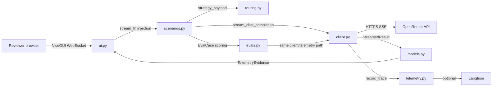

# Phase 6: Interview Walkthrough and Quality Gates - Research

**Researched:** 2026-08-20
**Domain:** Documentation + quality gates for a Python 3.12 / NiceGUI / httpx / Langfuse OpenRouter inference demo
**Confidence:** HIGH

## Summary

Phase 6 is a documentation + quality-gates phase over already-complete code (Phases 1–5). The code is finished and green: `uv run pytest` reports **100 passed**, `uv run ruff check .` reports **All checks passed!**. The work is therefore almost entirely (1) rewriting the stale `README.md`, (2) creating a missing architecture guide, (3) resolving a path discrepancy in the failure-tree/quickstart docs, and (4) fixing a wrong eval-CLI invocation in `quickstart.md`. No new dependencies are needed.

The audit found the following concrete gaps: `README.md` still describes only "Phase 1 status" and claims live inference/routing/telemetry/evals are "Not implemented yet" (stale); there is **no** `docs/architecture.md` (and no root `ARCHITECTURE.md`) even though `quickstart.md:94-95` lists it as an expected file; the failure tree exists at `docs/specs/failure-tree.md` rather than the `docs/failure-tree.md` path `quickstart.md` expects; and `quickstart.md:80` documents `uv run python -m openrouter_demo.evals`, which fails with `ModuleNotFoundError` because the project uses a `src` layout with `[tool.uv] package = false` — the correct form is `PYTHONPATH=src uv run python -m openrouter_demo.evals`.

The UI framing (DOC-04) is already correct — inference-operation metaphor, no chatbot labels. The focused tests (DOC-05) already cover all four required focus areas. DOC-06/DOC-07/DOC-08 already pass. So the plan should be surgical: docs rewrites/creations plus a guard test that pins the docs to the implemented behavior.

**Primary recommendation:** Treat this phase as *"make the docs truthful and add a doc-vs-code drift guard"* — rewrite `README.md` (preserving the strings `test_config.py:65` pins), add `docs/architecture.md`, reconcile the failure-tree path, fix the eval-CLI invocation in `quickstart.md`, and add one focused guard test that asserts docs reference the real files and commands.

<phase_requirements>
## Phase Requirements

| ID | Description | Research Support |
|----|-------------|------------------|
| DOC-01 | README explains the demo story, setup, env vars, and five-minute walkthrough. | README.md is stale (Phase 1 only). Story/walkthrough source material already exists in `docs/ux/demo-script.md` and `docs/specs/quickstart.md`. Guard test `tests/test_config.py:65` pins six strings that must survive the rewrite. |
| DOC-02 | Repository includes an architecture guide focused on routing, fallback, latency, cost, telemetry, and eval flow. | No `docs/architecture.md` exists. Closest artifacts: `.planning/research/ARCHITECTURE.md` (Component Boundaries table), `docs/PRD.md` §8, `docs/ux/technical-walkthrough.md` (file-inspection order). `quickstart.md:94-95` already names `docs/architecture.md` as expected. |
| DOC-03 | Repository includes a failure tree covering client, credential, request, provider, routing, timeout, telemetry, and display failures. | `docs/specs/failure-tree.md` exists and covers all 8 categories; its 7 diagnosis steps map to `client.py` error classes. Path mismatch: `quickstart.md:94` expects `docs/failure-tree.md`. |
| DOC-04 | UI avoids chatbot framing and keeps inference operation as the main product metaphor. | Already satisfied — verified labels/taglines in `ui.py`. No chatbot labels. Only `"role": "user"` is in the API payload (`client.py:136`), not UI. |
| DOC-05 | Focused tests cover response/error handling, routing configuration, telemetry normalization, and eval scoring. | Already satisfied — all four areas mapped to existing test files. 100 tests pass. |
| DOC-06 | `uv run pytest` passes. | Already passes: 100 passed in 3.47s. |
| DOC-07 | `uv run ruff check .` passes. | Already passes: "All checks passed!". Config in `pyproject.toml:25-27`. |
| DOC-08 | Reviewer can run the core demo with only `OPENROUTER_API_KEY`. | Already satisfied — `REQUIRED_ENV_VARS = (OPENROUTER_API_KEY,)`; Langfuse optional; `.env.example` exists. |
</phase_requirements>

<user_constraints>
## User Constraints (from CONTEXT.md)

None (no CONTEXT.md for this phase). The `.planning/phases/06-interview-walkthrough-and-quality-gates/` directory is empty.

### Project-level constraints (from AGENTS.md)

These are locked project constraints the planner must honor:

- **Tech stack**: Python 3.12+, NiceGUI, httpx, Langfuse Python SDK, uv, Ruff, pytest. `[VERIFIED: pyproject.toml:5-15]` — `requires-python = ">=3.12"`, deps `nicegui>=3.16.0`, `httpx>=0.28.1`, `langfuse>=4.14.4`; dev group `pytest>=9.1.1`, `ruff>=0.16.3`.
- **OpenRouter integration**: Direct OpenRouter Chat Completions over HTTPS; do not hide routing/metadata behind another router. `[VERIFIED: src/openrouter_demo/client.py:12]` — `OPENROUTER_CHAT_COMPLETIONS_URL = "https://openrouter.ai/api/v1/chat/completions"`.
- **Observability**: Langfuse optional at runtime; missing credentials must disable tracing visibly without blocking inference. `[VERIFIED: src/openrouter_demo/telemetry.py:31-34]` — `record_trace` returns `TraceOutcome(status="disabled", ...)` when `not config.langfuse_ready`.
- **Secrets**: Environment variables and `.env.example`; never commit API keys. `[VERIFIED: .env.example:1-7]` — all four vars documented as empty assignments.
- **Cost**: Default prompts and eval cases must remain small and bounded.
- **Metadata honesty**: Token, cost, provider, router, cache fields must distinguish unavailable from zero. `[VERIFIED: src/openrouter_demo/ui.py:39-41]` — unavailable copy strings; `src/openrouter_demo/models.py:6-14` — `UNAVAILABLE = Unavailable()` sentinel.
- **UI scope**: NiceGUI is the local browser UI; FastAPI is only an internal NiceGUI implementation detail.
- **Quality gate path**: `uv`, Ruff, and pytest (`[VERIFIED: .planning/STATE.md]` Decisions: "Use `uv`, Ruff, and pytest as the quality gate path.").

### Enforcement note (copilot-instructions / GSD)

`./copilot-instructions.md` is not present in the repo root (checked: repo root contains only `AGENTS.md`, `app.py`, `pyproject.toml`, `README.md`, `skills-lock.json`, and the `agent/`, `data/`, `docs/`, `evals/`, `src/`, `tests/` directories). AGENTS.md contains GSD workflow enforcement ("Before using Edit, Write... start work through a GSD command"). The Phase 6 plan is the GSD workflow entry point.
</user_constraints>

## Architectural Responsibility Map

| Capability | Primary Tier | Secondary Tier | Rationale |
|------------|-------------|----------------|-----------|
| README story + walkthrough (DOC-01) | Documentation (repo root) | — | Reviewer-facing; no runtime tier. |
| Architecture guide (DOC-02) | Documentation (`docs/`) | — | Describes the Python package, not runtime behavior. |
| Failure tree (DOC-03) | Documentation (`docs/`) | — | Diagnosis reference; must mirror `client.py`/`config.py` error classes. |
| UI inference framing (DOC-04) | Browser / Client (NiceGUI `ui.py`) | — | UI copy lives in `ui.py`; already correct. |
| Focused tests (DOC-05) | Test layer (`tests/`) | — | Four focus areas already covered. |
| pytest/ruff gates (DOC-06/07) | CI/local tooling (`pyproject.toml`) | — | Config already present and green. |
| Single-credential demo (DOC-08) | Config layer (`config.py`) + entrypoint (`app.py`) | API/Backend | `REQUIRED_ENV_VARS` drives readiness; Langfuse optional. |

## Current State Audit

### DOC-01 — README is STALE (Phase 1 only; needs full rewrite)

`README.md` section headings verbatim `[VERIFIED: README.md:1,5,11,16,22,35]`:

```
# OpenRouter Production Inference Lab
## Phase 1 status
## Prerequisites
## Install
## Configure
## Launch
```

Stale claims `[VERIFIED: README.md:7-9]`:

```
Implemented now: dependency setup, exported-env inspection, a NiceGUI setup shell, and importable package boundaries.

Not implemented yet: live inference, routing/fallback behavior, telemetry history, cache observations, Langfuse trace creation, and eval execution.
```

All "Not implemented yet" items are now implemented (Phases 2–5). The README does **not** mention the demo story, the five-minute walkthrough, the eval CLI, or the failure tree. It has no links to `docs/ux/demo-script.md`, `docs/specs/quickstart.md`, or `docs/specs/failure-tree.md`.

**Hard constraint on the rewrite** — `tests/test_config.py:65` `test_readme_documents_setup` asserts README.md contains these exact substrings `[VERIFIED: tests/test_config.py:72-79]`:

```
"uv sync",
"uv run python app.py",
OPENROUTER_API_KEY,
LANGFUSE_PUBLIC_KEY,
LANGFUSE_SECRET_KEY,
LANGFUSE_BASE_URL,
```

The rewrite must preserve all six strings or this currently-passing test will break.

Note: README.md:24 still says `this app does not parse \`.env\` files in Phase 1.` — the "in Phase 1" qualifier is stale; the app **never** parses `.env` (there is no `python-dotenv` dependency), it reads exported env vars only `[VERIFIED: src/openrouter_demo/config.py:24-25]` (`source = os.environ if environ is None else environ`).

### DOC-02 — Architecture guide is MISSING (GAP)

- **No** `docs/architecture.md` and **no** root `ARCHITECTURE.md`. A repo-wide search for `ARCHITECTURE.md` / `architecture*.md` returned only `.planning/research/ARCHITECTURE.md` `[VERIFIED: file_search]`.
- `AGENTS.md` `## Architecture` section states `[VERIFIED: AGENTS.md]`: `Architecture not yet mapped. Follow existing patterns found in the codebase.`
- `docs/design/DESIGN.md` and `docs/design/DESIGN-light.md` are **design-system token files** (colors/typography), not architecture guides. `DESIGN.md:1` frontmatter `name: ishlab AI Inference Demo`; it defines `primary: '#dcb8ff'`, `secondary: '#42f197'` and typography `Work Sans` / `JetBrains Mono`. `DESIGN-light.md:1` `name: Vibrant Kinetic` with `Inter` typography. Neither discusses routing, fallback, latency, cost, telemetry, or eval flow.
- `docs/llms.txt` is the bundled NiceGUI reference (`nicegui/llms.md` shipped with the package), not a project architecture guide.
- `docs/PRD.md` §8 has an ASCII architecture diagram (NiceGUI app → Python service layer → OpenRouter), but the PRD is a product doc, not an architecture guide.
- `docs/ux/technical-walkthrough.md:9-17` gives a "Recommended inspection order" (`app.py` → `ui.py` → `routing.py` → `client.py` → `telemetry.py` → `scenarios.py` → `evals.py`) — closest existing prose, but not a routing/fallback/latency/cost/telemetry/eval-flow architecture doc.
- **Source of truth for the guide:** `.planning/research/ARCHITECTURE.md` `## Component Boundaries` table already documents the 9-module layout and data flow (Phase-1 research artifact, still accurate). The planner should promote this into `docs/architecture.md`.
- `docs/specs/quickstart.md:94-95` already names the expected files `[VERIFIED: docs/specs/quickstart.md:94-95]`:

```
# Files expected after implementation
README.md
docs/failure-tree.md
docs/architecture.md
```

### DOC-03 — Failure tree EXISTS at the wrong path; content matches the code

`docs/specs/failure-tree.md` top-level headings verbatim `[VERIFIED: docs/specs/failure-tree.md:1,3,9,53,289,391]`:

```
# Failure Tree - OpenRouter Production Inference Lab
## Purpose
## High-level tree
## Diagnosis path
## Failure examples
## Debugging rule of thumb
```

The `## High-level tree` covers all eight required categories verbatim `[VERIFIED: docs/specs/failure-tree.md:11-49]`:

```
+-- Client / Python
+-- Authentication / API
+-- OpenRouter routing
+-- Runtime
+-- Observability
+-- Application UI
```

The 7 diagnosis steps map 1:1 to implemented error handling in `client.py`:

| Failure-tree step | Implemented in |
|-------------------|----------------|
| `### 1. Did the request leave the app correctly?` (failure-tree.md:55) | `client.py:12` URL, `client.py:135-139` request body + headers |
| `### 2. Did authentication/API validation fail?` (:83) | `client.py:21` `class OpenRouterAuthError(OpenRouterError)`; `client.py:168-172` `if response.status_code == 401:` raises `OpenRouterAuthError` |
| `### 3. Did routing constraints prevent a usable route?` (:117) | `routing.py:50-55` `STRATEGIES`; `routing.py:57-62` `strategy_payload` |
| `### 4. Did the provider or runtime degrade?` (:151) | `client.py:39` `class OpenRouterTimeoutError(OpenRouterError)`; `client.py:243-244` `except httpx.TimeoutException as exc:` raises `OpenRouterTimeoutError` |
| `### 5. Did fallback work as intended?` (:185) | `scenarios.py:33-88` `run_fallback_scenario`; `ui.py:120` fallback success copy |
| `### 6. Is telemetry missing or misleading?` (:224) | `telemetry.py:25-48` `record_trace`; `models.py:6-14` sentinel |
| `### 7. Did the UI hide the real state?` (:261) | `ui.py:117-122` status copy |

Error-class hierarchy verbatim `[VERIFIED: src/openrouter_demo/client.py:15,21,25,39]`:

```
class OpenRouterError(Exception):
class OpenRouterAuthError(OpenRouterError):
class OpenRouterHTTPError(OpenRouterError):
class OpenRouterTimeoutError(OpenRouterError):
```

The tree references `.env.example`, which exists `[VERIFIED: .env.example:1-7]`.

**Two path/copy mismatches to resolve:**
1. **Path**: the tree lives at `docs/specs/failure-tree.md`, but `quickstart.md:94` expects `docs/failure-tree.md`. Planner must either move/link it or fix the quickstart path.
2. **"User-facing copy" snippets are illustrative, not literal UI strings.** The tree's `User-facing copy` blocks (e.g. `Authentication failed. Check OPENROUTER_API_KEY in your environment.` at failure-tree.md:97-98, and `OpenRouter returned a rate limit response...` at :101-102) do **not** match the actual UI copy, which is `FAILURE_RESPONSE = "Request failed before fallback could complete."` `[VERIFIED: src/openrouter_demo/ui.py:119]`. One tree copy **does** match: `Langfuse tracing disabled. Configure Langfuse credentials to enable trace links.` matches `TRACE_DISABLED` `[VERIFIED: src/openrouter_demo/ui.py:122]`. A Phase-6 task should reconcile these snippets with the literal `ui.py` strings.

### DOC-04 — UI framing is ALREADY correct (no chatbot labels)

The UI is inference-operation framed, not chatbot framed. Verbatim labels/taglines `[VERIFIED: src/openrouter_demo/ui.py:679,781-782]`:

```
ui.page_title("OpenRouter Production Inference Lab")
ui.label("Route, observe, recover, and evaluate model calls.")
ui.label("A model call is easy. Operating inference is the real problem.")
```

Inference-flavored controls/labels verbatim `[VERIFIED: src/openrouter_demo/ui.py:808,813,819,833,837,841]`:

```
ui.label("Prompt")
ui.label("Sample prompt")
ui.label("Strategy")
repeat_enabled = ui.switch("Repeat previous prompt", value=False)
simulate_failure = ui.switch("Simulate primary route failure", value=False)
run_button = ui.button("Run Inference", on_click=run_request)
```

Panel labels verbatim `[VERIFIED: src/openrouter_demo/ui.py:694,292,301,318]`:

```
ui.label("Streaming response")
ui.label("Telemetry")
ui.label("Run history")
ui.label("Comparison")
```

There are **no** "chat", "assistant", or "user" role labels anywhere in the UI. The only `"role": "user"` string is the API request body `[VERIFIED: src/openrouter_demo/client.py:136]`:

```
body: dict[str, object] = {**strategy_payload(strategy), "messages": [{"role": "user", "content": prompt}], "stream": True}
```

That is an OpenRouter API contract detail, not UI copy. The demo narrative already states the intent `[VERIFIED: docs/ux/demo-narrative.md]`: `Intent: establish that the UI is an operating surface, not a chatbot.`

**Conclusion:** DOC-04 needs no code change. The plan should include a lightweight guard assertion (or rely on existing `test_ui.py`) rather than modifying `ui.py`.

### DOC-05 — Focused tests already cover all four focus areas

Mapping of the four required focus areas to existing test files (all verified by reading the grep of `def test_*`):

| Focus area | Test files (function:line) | Status |
|-----------|---------------------------|--------|
| Response/error handling | `tests/test_client.py` — `test_stream_401_raises_auth_error:158`, `test_stream_preserves_partial_text_on_error_payload:241`; `tests/test_ui.py` — `test_run_inference_records_partial_text_on_stream_failure:99`, `test_run_inference_rejects_blank_prompt:116`; `tests/test_scenarios.py` — fallback primary/fallback paths | ✅ |
| Routing configuration | `tests/test_routing.py` — `test_default_strategy_payload_has_no_provider:12`, `test_cost_strategy_payload_includes_price_sort:18`, `test_latency_strategy_payload_includes_latency_sort:24`, `test_fallback_primary_strategy_payload_includes_allow_fallbacks_false:30`, `test_strategies_dict_contains_three_selectable_strategies:36` | ✅ |
| Telemetry normalization | `tests/test_telemetry.py` — `test_telemetry_evidence_round_trip_preserves_sentinels:46`, `test_extract_cache_hit_write_and_absent:76`, `test_record_trace_disabled_without_credentials:139`; `tests/test_sqlite_store.py` — `test_round_trip_preserves_sentinels_cache_trace_and_fallback:18`; `tests/test_repeat.py` — `test_repeat_scenario_reports_cache_hit_from_run_2:29`, `test_repeat_scenario_reports_absent_cache_with_latency_and_cost:73`; `tests/test_imports.py` — `test_unavailable_metadata_is_not_zero:67` | ✅ |
| Eval scoring | `tests/test_evals.py` — `test_score_response_passes_and_fails:66`, `test_load_cases_reads_three_to_five_cases:89`, `test_run_eval_case_result_fields:119`, `test_run_eval_set_compares_two_strategies:214` | ✅ |

**Gaps:** none in the four required focus areas. The only doc-related guard tests are `tests/test_config.py:57` `test_env_example_is_only_empty_assignments` and `tests/test_config.py:65` `test_readme_documents_setup`. There is **no** test that pins `docs/architecture.md` existence or the eval-CLI invocation — the planner may add one as a Phase-6 drift guard (see Common Pitfalls).

### DOC-06 / DOC-07 — Quality gates already PASS (observed this session)

- `uv run pytest -q` → **`100 passed in 3.47s`** `[VERIFIED: run this session]`.
- `uv run ruff check .` → **`All checks passed!`** `[VERIFIED: run this session]`.

Config `[VERIFIED: pyproject.toml:19-27]`:

```
[tool.uv]
package = false

[tool.pytest.ini_options]
testpaths = ["tests"]
pythonpath = ["src"]

[tool.ruff]
target-version = "py312"
line-length = 100
```

Dev dependencies `[VERIFIED: pyproject.toml:13-15]`:

```
[dependency-groups]
dev = [
    "pytest>=9.1.1",
    "ruff>=0.16.3",
]
```

### DOC-08 — Core demo runs with only OPENROUTER_API_KEY (satisfied by code)

- Required env vars verbatim `[VERIFIED: src/openrouter_demo/config.py:10-11]`:

```
REQUIRED_ENV_VARS = (OPENROUTER_API_KEY,)
LANGFUSE_ENV_VARS = (LANGFUSE_PUBLIC_KEY, LANGFUSE_SECRET_KEY, LANGFUSE_BASE_URL)
```

- `load_config` reads `os.environ` directly (no `.env` parsing) and sets `openrouter_ready` from the single required var, `langfuse_ready` only when all three Langfuse vars are present `[VERIFIED: src/openrouter_demo/config.py:24-33]`.
- Entrypoint `[VERIFIED: app.py:13-19,30]`:

```
def main() -> None:
    config = load_config()
    ...
    history = SQLiteRunHistory(db_path="data/runs.db")
    build_app(config, history)
    ...
    ui.run(title="OpenRouter Production Inference Lab", reload=False)
```

- The app launches without Langfuse: `build_app` renders a "Langfuse tracing" badge showing `TRACE_DISABLED` when not ready `[VERIFIED: src/openrouter_demo/ui.py:122]`; `record_trace` short-circuits to `disabled` `[VERIFIED: src/openrouter_demo/telemetry.py:31-34]`.
- `app.py` also exposes a `/health` endpoint returning `"status": "ok" if config.openrouter_ready else "degraded"` `[VERIFIED: app.py:22-28]`.
- `.env.example` documents all four vars as empty assignments `[VERIFIED: .env.example:1-7]`.
- **Caveat:** I did **not** launch the full NiceGUI server (it blocks), but the code path is unambiguous and `tests/test_config.py` already exercises `load_config` for every combination. DOC-08 should be treated as satisfied pending the standard `/gsd-verify-work` live check.

### Eval CLI and demo script — one stale command found

- Eval CLI entry point `[VERIFIED: src/openrouter_demo/evals.py:361,416-417]`: `def main(argv: list[str] | None = None) -> int:` … `if __name__ == "__main__": sys.exit(main())`. Exit contract `[VERIFIED: evals.py:366,413]`: `return 1` on config errors, `return 2` on runtime errors, `return 0` on success.
- CLI args `[VERIFIED: evals.py:347-357]`: `--cases` (default `evals/cases.json`), `--strategies` (default `default,cost`), `--models`, `--limit`, `--json`.
- **Verified this session** `[VERIFIED: run this session]`:
  - `uv run python -m openrouter_demo.evals` → `ModuleNotFoundError: No module named 'openrouter_demo'`.
  - `PYTHONPATH=src uv run python -m openrouter_demo.evals` → `OPENROUTER_API_KEY is not set. Export it and retry.` (correct exit-1 path).
- Therefore `docs/specs/quickstart.md:80` `uv run python -m openrouter_demo.evals` is **wrong** — it omits `PYTHONPATH=src`. The locked decision in `STATE.md` states the canonical form `[VERIFIED: .planning/STATE.md]`: `Eval CLI is PYTHONPATH=src uv run python -m openrouter_demo.evals with exit codes 0 (ran) / 1 (config error) / 2 (runtime error).`
- Walkthrough source material is current and reusable: `docs/ux/demo-script.md` (30-second pitch, 2-minute, 5-minute `### 0:00-0:30` … `### 4:30-5:00` segments, likely-interviewer-questions), `docs/ux/demo-narrative.md` (story structure + 5-minute walkthrough), and `docs/specs/quickstart.md` (8 validation steps). None are stale except the eval invocation in step 6.

## Standard Stack

No new libraries are introduced by this phase. All work uses the existing dependency set.

### Core (runtime)
| Library | Version | Purpose | Why Standard |
|---------|---------|---------|--------------|
| nicegui | >=3.16.0 | Local browser UI | Already the locked UI layer `[VERIFIED: pyproject.toml:7]`. |
| httpx | >=0.28.1 | Async OpenRouter streaming client | `[VERIFIED: pyproject.toml:8]`. |
| langfuse | >=4.14.4 | Optional tracing | `[VERIFIED: pyproject.toml:9]`. |

### Tooling (dev)
| Library | Version | Purpose |
|---------|---------|---------|
| pytest | >=9.1.1 | Test runner `[VERIFIED: pyproject.toml:14]`. |
| ruff | >=0.16.3 | Lint + format `[VERIFIED: pyproject.toml:15]`. |

### Alternatives Considered
| Instead of | Could Use | Tradeoff |
|------------|-----------|----------|
| Writing docs by hand | MkDocs / Sphinx | Unnecessary — the repo is a small interview artifact; Markdown in `docs/` is the established convention. |
| Adding a doc-lint dependency | e.g. markdownlint | Unnecessary — a small pytest guard (`tests/test_config.py` pattern) can pin doc-vs-code drift without a new dep. |

**Installation:** none required — `uv sync` already resolves the full dependency set.

**Version verification:** versions already declared and pinned as lower bounds in `pyproject.toml:5-15`; no registry lookup needed since no new packages are proposed.

## Package Legitimacy Audit

> This phase installs **zero** new external packages. All work is documentation and guard-test changes over the existing dependency set. No Package Legitimacy Gate protocol run is required.

| Package | Registry | Verdict | Disposition |
|---------|----------|---------|-------------|
| (none new) | — | — | — |

**Packages removed due to [SLOP] verdict:** none.
**Packages flagged as suspicious [SUS]:** none.

## Architecture Patterns

### System Architecture Diagram

Existing conceptual data flow (from `.planning/research/ARCHITECTURE.md`, still accurate, to be promoted into `docs/architecture.md`):



Entry point: `app.py` (`main()` → `load_config()` → `SQLiteRunHistory(db_path="data/runs.db")` → `build_app(config, history)` → `ui.run(...)`) `[VERIFIED: app.py:13-30]`.

### Recommended Project Structure (existing — do not change)

```
src/openrouter_demo/
├── __init__.py     # __version__ = "0.1.0"  [VERIFIED]
├── config.py       # env-var readiness (REQUIRED_ENV_VARS, LANGFUSE_ENV_VARS)
├── client.py       # OpenRouter streaming + typed errors
├── routing.py      # RoutingStrategy, STRATEGIES, strategy_payload
├── models.py       # frozen dataclasses + UNAVAILABLE sentinel
├── scenarios.py    # fallback + repeat orchestration
├── telemetry.py    # record_trace (optional Langfuse)
├── evals.py        # deterministic eval CLI + scoring
├── sqlite_store.py # SQLiteRunHistory persistence
├── history.py      # in-memory RunHistory
└── ui.py           # NiceGUI build_app (inference-operation framing)
docs/
├── PRD.md
├── specs/{failure-tree,quickstart,data-model,acceptance-criteria}.md
├── ux/{demo-script,demo-narrative,technical-walkthrough}.md
└── design/{DESIGN,DESIGN-light}.md   # design tokens, NOT architecture
tests/              # 11 test files, 100 tests
evals/cases.json    # 5 checked-in deterministic cases
```

### Pattern 1: Doc-vs-code guard test (the Phase-6 structural pattern)
**What:** Pin the docs to the code with a focused pytest that asserts the files/strings the docs promise actually exist and are correct — mirroring the existing `test_readme_documents_setup` / `test_env_example_is_only_empty_assignments` in `tests/test_config.py`.
**When to use:** Whenever Phase 6 changes `README.md`, creates `docs/architecture.md`, or fixes the failure-tree/quickstart paths.
**Example:**
```python
# Source: tests/test_config.py:57-79 (existing pattern to extend)
def test_env_example_is_only_empty_assignments() -> None:
    text = Path(".env.example").read_text()
    for name in (OPENROUTER_API_KEY, LANGFUSE_PUBLIC_KEY, LANGFUSE_SECRET_KEY, LANGFUSE_BASE_URL):
        assert f"{name}=" in text
    assignments = [line for line in text.splitlines() if line and not line.startswith("#")]
    assert all(line.endswith("=") for line in assignments)
```

### Anti-Patterns to Avoid
- **Docs drift from code:** writing a README that promises behavior/commands the code does not actually have (the current stale README is the example). Pin with guard tests.
- **Chatbot framing creeping back into UI:** any new UI label using "chat", "assistant", or conversation roles would violate DOC-04; the correct vocabulary is Prompt / Strategy / Run / Model / Provider / Telemetry.
- **Treating FastAPI as a product layer:** NiceGUI's internal FastAPI is an implementation detail; never document it as a distinct service.
- **Fake metadata:** never present `0` / `0.0` / `""` for missing telemetry — always the `UNAVAILABLE` sentinel rendered through `_UNAVAILABLE_COPY` etc.

## Don't Hand-Roll

| Problem | Don't Build | Use Instead | Why |
|---------|-------------|-------------|-----|
| Missing-telemetry representation | A custom "None vs 0" scheme | Existing `UNAVAILABLE` sentinel + `serialize_value`/`deserialize_value` (`models.py:6-33`) | Already round-trips through SQLite and JSON. |
| Routing definitions | New routing abstraction | Existing `routing.STRATEGIES` + `strategy_payload` (`routing.py:50-62`) | Locked decision; `custom` fallback primary is excluded from selectable strategies. |
| Run persistence | New DB layer | Existing `sqlite_store.SQLiteRunHistory` (`db_path="data/runs.db"`) | Already wired in `app.py:18`. |
| Tracing | New tracing wrapper | Existing `telemetry.record_trace` returning `TraceOutcome(enabled/disabled/failed)` | Never blocks inference (`telemetry.py:31-48`). |
| Eval scoring | New eval harness | Existing `evals.score_response` + `evals.load_cases` (`evals.py:63-99`) | Locked deterministic keyword scoring. |
| Doc linting / Markdown validation | New lint tooling | A small pytest guard in `tests/` | Keeps the repo dependency-light. |
| Error classification | New error taxonomy | Existing `OpenRouterError` hierarchy (`client.py:15-39`) | The failure tree already maps to it. |

**Key insight:** everything a Phase-6 task might "build" (architecture diagram, doc validation, telemetry explanation) already exists in code or in `.planning/research/ARCHITECTURE.md`. The phase is promotion and reconciliation, not construction.

## Common Pitfalls

### Pitfall 1: Rewriting README and breaking the pinned guard test
**What goes wrong:** `tests/test_config.py:65` `test_readme_documents_setup` asserts the README contains `uv sync`, `uv run python app.py`, and all four env-var names. A README rewrite that renames/drops any of these fails the suite.
**Why it happens:** the guard test was written in Phase 1 and is easy to forget when restructuring the README.
**How to avoid:** preserve all six substrings verbatim in the new README; keep the Install/Configure/Launch sections with the exact commands.
**Warning signs:** `uv run pytest` fails only in `test_readme_documents_setup` after the rewrite.

### Pitfall 2: Documenting the wrong eval-CLI invocation
**What goes wrong:** copying `uv run python -m openrouter_demo.evals` from `quickstart.md:80` — it raises `ModuleNotFoundError` because `[tool.uv] package = false` and the package lives under `src/`.
**Why it happens:** pytest works because `pythonpath = ["src"]` is set in `pyproject.toml:23`, but that only affects pytest, not `python -m`.
**How to avoid:** document `PYTHONPATH=src uv run python -m openrouter_demo.evals` (the locked `STATE.md` form) and add a guard test that asserts the canonical command string appears in the docs.
**Warning signs:** reviewer's `uv run python -m openrouter_demo.evals` errors with `No module named 'openrouter_demo'`.

### Pitfall 3: Failure-tree path mismatch (`docs/specs/` vs `docs/`)
**What goes wrong:** `quickstart.md:94` promises `docs/failure-tree.md`, but the file is at `docs/specs/failure-tree.md`.
**Why it happens:** docs were seeded before the final `docs/` layout was settled.
**How to avoid:** move/copy the tree to `docs/failure-tree.md` or update the quickstart link — and keep `docs/architecture.md` at the same level for consistency.
**Warning signs:** the walkthrough's "Files expected after implementation" list doesn't resolve.

### Pitfall 4: Chatbot framing creeping back into the UI
**What goes wrong:** future edits add "chat", "assistant", or conversation-role labels, violating DOC-04.
**Why it happens:** the underlying API uses `"role": "user"`, so it's tempting to mirror API vocabulary in the UI.
**How to avoid:** keep UI copy to Prompt / Sample prompt / Strategy / Run Inference / Streaming response / Telemetry / Run history. A guard test can assert the absence of `"chat"` / `"assistant"` in `ui.py`'s user-visible labels if the planner wants belt-and-suspenders.
**Warning signs:** new labels mention "chat" or "messages" in `ui.py`.

### Pitfall 5: Metadata "0 vs unavailable" honesty regressing in docs
**What goes wrong:** docs claim cost/tokens/cache are "shown" without noting they may be unavailable, contradicting the metadata-honesty constraint.
**Why it happens:** copywriting over-promises what a route/provider may not return.
**How to avoid:** every doc mention of cost/tokens/cache/model/provider must carry the "when available, otherwise shown as unavailable" qualifier, matching `_UNAVAILABLE_COPY` / `_COST_UNAVAILABLE_COPY` `[VERIFIED: ui.py:39-41]`.
**Warning signs:** architecture guide says "cost is displayed" with no availability caveat.

### Pitfall 6: ruff/pytest passing locally but not for the reviewer
**What goes wrong:** the gates pass in the author's env but fail in a clean checkout.
**Why it happens:** this repo's pytest passes due to `pythonpath = ["src"]`; a clean checkout without `uv sync` would fail differently. Also `.env.example` must exist for `test_env_example_is_only_empty_assignments`.
**How to avoid:** docs must prescribe `uv sync` before `uv run pytest` / `uv run ruff check .`; keep `.env.example` checked in.
**Warning signs:** reviewer runs gates without `uv sync`.

## Code Examples

Verified patterns the docs/guard-tests should reference verbatim:

### 1. Required vs optional env vars
```python
# Source: src/openrouter_demo/config.py:10-11
REQUIRED_ENV_VARS = (OPENROUTER_API_KEY,)
LANGFUSE_ENV_VARS = (LANGFUSE_PUBLIC_KEY, LANGFUSE_SECRET_KEY, LANGFUSE_BASE_URL)
```

### 2. Typed error hierarchy (failure tree maps to these)
```python
# Source: src/openrouter_demo/client.py:15,21,25,39
class OpenRouterError(Exception):
class OpenRouterAuthError(OpenRouterError):
class OpenRouterHTTPError(OpenRouterError):
class OpenRouterTimeoutError(OpenRouterError):
```

### 3. Trace short-circuit (DOC-08 proof)
```python
# Source: src/openrouter_demo/telemetry.py:31-34
    if not config.langfuse_ready:
        return TraceOutcome(status="disabled", trace_id=None, trace_url=None)
```

### 4. Unavailable copy (metadata honesty)
```python
# Source: src/openrouter_demo/ui.py:39-41
_UNAVAILABLE_COPY = "Unavailable from selected route/provider."
_COST_UNAVAILABLE_COPY = "Cost metadata was not returned for this route/provider."
_LATENCY_UNAVAILABLE_COPY = "Latency was not returned for this route/provider."
```

### 5. Canonical eval invocation (fix quickstart to this)
```bash
# Source: .planning/STATE.md (locked decision) — verified this session
PYTHONPATH=src uv run python -m openrouter_demo.evals
```

## Validation Architecture

*(Included because `.planning/config.json` has `workflow.nyquist_validation: true`.)*

### Test Framework
| Property | Value |
|----------|-------|
| Framework | pytest >=9.1.1 `[VERIFIED: pyproject.toml:14]` |
| Config file | `pyproject.toml:21-23` — `testpaths = ["tests"]`, `pythonpath = ["src"]` |
| Quick run command | `uv run pytest -q` |
| Full suite command | `uv run pytest` |

### Phase Requirements → Test Map
| Req ID | Behavior | Test Type | Automated Command | File Exists? |
|--------|----------|-----------|-------------------|-------------|
| DOC-04 | UI uses inference framing (no chatbot labels) | unit | `uv run pytest tests/test_ui.py -q` | ✅ |
| DOC-05 | response/error, routing, telemetry, eval scoring | unit | `uv run pytest -q` | ✅ |
| DOC-06 | pytest passes | gate | `uv run pytest` | ✅ (100 passed) |
| DOC-07 | ruff passes | gate | `uv run ruff check .` | ✅ (clean) |
| DOC-08 | single-credential demo | unit + manual | `uv run pytest tests/test_config.py -q`; live check in `/gsd-verify-work` | ✅ code, ⚠️ live check pending |
| DOC-01/02/03 | docs truthfulness | **Wave 0 gap** — new guard test | `uv run pytest tests/test_docs.py -q` | ❌ Wave 0 |

### Sampling Rate
- **Per task commit:** `uv run pytest -q`
- **Per wave merge:** `uv run pytest && uv run ruff check .`
- **Phase gate:** full suite + ruff green before `/gsd-verify-work`.

### Wave 0 Gaps
- [ ] `tests/test_docs.py` (or extend `tests/test_config.py`) — assert `docs/architecture.md` exists, assert README contains the canonical eval command, assert failure-tree/quickstart paths resolve. Covers DOC-01/02/03.
- [ ] *(No framework install needed — pytest is already configured.)*

## Security Domain

*(Included because `.planning/config.json` has `security_enforcement: true`.)*

### Applicable ASVS Categories

| ASVS Category | Applies | Standard Control |
|---------------|---------|-----------------|
| V2 Authentication | No | Local interview demo; no user accounts (`AGENTS.md` Out of Scope). |
| V3 Session Management | No | No sessions/accounts. |
| V4 Access Control | No | Single local user. |
| V5 Input Validation | Yes | `ui.py` `_run_inference` rejects blank prompts (`raise ValueError("Prompt must not be blank.")` `[VERIFIED: ui.py:340-341]`); `evals.py` validates 3–5 cases. |
| V6 Cryptography | No | No crypto; API key handled as env var only. |

### Known Threat Patterns for this stack
| Pattern | STRIDE | Standard Mitigation |
|---------|--------|---------------------|
| Secret leak into docs/git | Information disclosure | `.env.example` with empty assignments only; never document real keys `[VERIFIED: .env.example:1-7]`. |
| Secret leak into Langfuse trace input | Information disclosure | `tests/test_evals.py:192` and `tests/test_telemetry.py:168` assert the trace input contains no API key. |
| Uncontrolled spend | Denial of service (self-inflicted) | Small bounded default prompts + 5 checked-in eval cases; `request_timeout=60.0` default in `client.py`. |
| Trace blocking inference | Availability | `record_trace` catches all exceptions and returns `failed`; never raises `[VERIFIED: telemetry.py:46-48]`. |

## Environment Availability

| Dependency | Required By | Available | Version | Fallback |
|------------|------------|-----------|---------|----------|
| Python | runtime | ✓ | (project requires >=3.12) | — |
| uv | install/run | ✓ | present (used this session) | — |
| pytest | DOC-06 | ✓ | 100 passed | — |
| ruff | DOC-07 | ✓ | clean | — |
| OPENROUTER_API_KEY | live inference | — (env var, reviewer-supplied) | — | app shows setup guidance; evals exit 1 |
| Langfuse creds | optional tracing | — (optional) | — | `record_trace` returns `disabled` |

**Missing dependencies with no fallback:** none — the repo has no external service dependency beyond the reviewer's OpenRouter key.
**Missing dependencies with fallback:** Langfuse credentials (optional; app degrades to "tracing disabled").

## Assumptions Log

| # | Claim | Section | Risk if Wrong |
|---|-------|---------|---------------|
| A1 | The canonical docs layout is `docs/architecture.md` + `docs/failure-tree.md` (top-level), per `quickstart.md:94-95`. | DOC-02/DOC-03 | If the team prefers `docs/specs/`, the planner should instead update `quickstart.md` paths. Low risk; either resolution satisfies DOC-02/DOC-03. |
| A2 | No `CONTEXT.md` exists for Phase 6 (directory is empty), so all constraints come from AGENTS.md + STATE.md decisions. | User Constraints | If a CONTEXT.md is later written before planning, its locked decisions take precedence. |
| A3 | The full NiceGUI app launches with only `OPENROUTER_API_KEY` without a live check this session; inferred from `config.py` + `telemetry.py` code paths. | DOC-08 | Low — `tests/test_config.py` covers all config combos; final live confirmation belongs to `/gsd-verify-work`. |

**If this table were empty:** it is not — the three items above are the only non-`[VERIFIED]`/`[CITED]` claims, all low-risk.

## Open Questions

1. **Where should the architecture guide and failure tree live — `docs/` or `docs/specs/`?**
   - What we know: `quickstart.md:94-95` promises `docs/failure-tree.md` and `docs/architecture.md`; the tree currently sits at `docs/specs/failure-tree.md`.
   - What's unclear: whether to move files or update the quickstart links.
   - Recommendation: create `docs/architecture.md` and **move** (or symlink) the failure tree to `docs/failure-tree.md` so the walkthrough's "Files expected after implementation" resolves as written; keep `docs/specs/` for spec-level docs.

2. **Should DOC-04 get an explicit "no chatbot labels" guard test?**
   - What we know: `ui.py` is already correct; no test asserts the absence of chatbot framing.
   - What's unclear: whether the team wants an assertion pinning this to prevent regression.
   - Recommendation: add a lightweight `tests/test_docs.py` assertion (or a `test_ui.py` assertion) that `"chat"` and `"assistant"` do not appear in user-visible UI labels — cheap insurance for a stated success criterion.

3. **Is `PYTHONPATH=src` acceptable to document, or should the project add an entry-point script?**
   - What we know: `uv run python -m openrouter_demo.evals` fails without it; `app.py` sidesteps this via `sys.path.insert(0, .../src)` `[VERIFIED: app.py:1-4]`.
   - What's unclear: whether to keep documenting `PYTHONPATH=src` or add a `[project.scripts]` entry point (would flip `package = false`).
   - Recommendation: keep `package = false` and document `PYTHONPATH=src uv run python -m openrouter_demo.evals`; do not add packaging surface in Phase 6.

## Sources

### Primary (HIGH confidence — read this session)
- `src/openrouter_demo/config.py` (full) — env-var contract.
- `src/openrouter_demo/client.py` (full) — error hierarchy, streaming, metadata extraction.
- `src/openrouter_demo/ui.py` (full) — UI framing and copy.
- `src/openrouter_demo/{models,routing,scenarios,telemetry,evals,sqlite_store,history}.py` — module layout and contracts.
- `app.py`, `pyproject.toml`, `.env.example`, `README.md` — entrypoint, config, secrets template, stale README.
- `tests/` (grep of all `test_*` defs) — focus-area coverage map.
- `docs/specs/failure-tree.md`, `docs/specs/quickstart.md`, `docs/specs/data-model.md`, `docs/PRD.md` — failure tree, quickstart, data model.
- `docs/ux/demo-script.md`, `docs/ux/demo-narrative.md`, `docs/ux/technical-walkthrough.md` — walkthrough source material.
- `.planning/{REQUIREMENTS,ROADMAP,STATE,config}.md/.json` and `.planning/research/ARCHITECTURE.md` — phase scope, decisions, config flags.
- Runtime observation: `uv run pytest -q` (100 passed), `uv run ruff check .` (clean), and the two eval-CLI invocations (ModuleNotFoundError vs exit-1).

### Secondary (MEDIUM confidence)
- None — no external web/docs lookups were needed; this phase is an in-repo audit (all web-search providers are disabled in `.planning/config.json`).

### Tertiary (LOW confidence)
- None.

## Metadata

**Confidence breakdown:**
- Standard stack: HIGH — read `pyproject.toml` directly; no new packages.
- Architecture: HIGH — read every `src/openrouter_demo/*.py` file and `.planning/research/ARCHITECTURE.md`.
- Pitfalls: HIGH — each pitfall traced to a specific file:line or observed this session.

**Research date:** 2026-08-20
**Valid until:** 2026-09-03 (30 days — stable codebase, docs-only phase).
