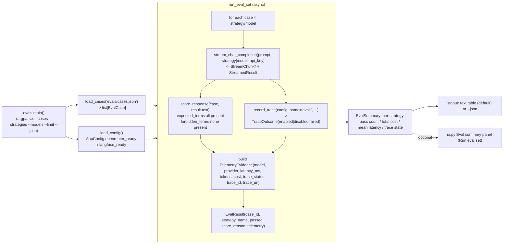

# Phase 05 Research: Deterministic Evals

## Summary

Phase 5 adds the smallest decision-loop that proves model/routing changes are checked before being
treated as safe: a deterministic eval set of three to five checked-in cases, a runner that executes
each case against at least two routing strategies (or two models), and a summary that compares
pass/fail, latency, tokens/cost, and trace state side by side. It consumes the already-shipped
Phase 2–4 machinery — `client.stream_chat_completion`, `routing.STRATEGIES`, `models.TelemetryEvidence`
with its `Unavailable` sentinel, and `telemetry.record_trace` — rather than building any new
inference path.

Two facts shape the whole phase. First, the repo already contains eval seed material in `data/`:
`data/api-complaint.csv` (14 customer-complaint cases with per-case `binary_criteria`,
`auto_fail`, `min_tone_score`, `required_behaviors`, and `prohibited_behaviors`),
`data/api-complaint-rubric.md` (an 8-criterion binary rubric + 1–5 tone scale + auto-fail list +
composite formula), and `data/api-complaint-eval.csv` (a 3-column prompt extract). Second, the
rubric's tone score and composite formula assume an **LLM judge**, which is explicitly deferred to
V2-01 ("Add optional LLM-as-judge scoring after deterministic evals are stable"). Deterministic v1
therefore scores only the **binary criteria** (and auto-fail conditions) via keyword/pattern
matching — no tone score, no judge call, no new dependency. [VERIFIED: REQUIREMENTS.md V2-01;
docs/specs/research.md "Use deterministic eval scoring as the floor"]

The phase must also **update two Phase 1/4 test guards** that will otherwise fail the first time
`evals.py` is implemented and `evals/cases.json` is created: `tests/test_imports.py`
(`test_live_boundaries_raise_honest_phase_errors`, `test_evals_directory_has_no_phase1_cases`). And
the documented CLI invocation `uv run python -m openrouter_demo.evals` fails without
`PYTHONPATH=src` because `[tool.uv] package = false` leaves the `src/` package uninstalled — this
was verified directly this session (see Common Pitfalls).

**Primary recommendation:** Implement `evals.py` as the single owner of eval cases, scoring, and
command output: a checked-in `evals/cases.json` with 5 cases derived from `data/api-complaint.csv`
(each carrying deterministic `expected_terms` / `forbidden_terms` keyword lists), a pure
`score_response(case, text)` predicate, an async `run_eval_case(...)` that reuses
`stream_chat_completion` + `record_trace` and builds a `TelemetryEvidence` per result, an
`EvalSummary` aggregator that compares ≥2 strategies, and an argparse `main()` invoked as
`PYTHONPATH=src uv run python -m openrouter_demo.evals`.

**Confidence:** HIGH

<phase_requirements>
## Phase Requirements

| ID | Description | Research Support |
|----|-------------|------------------|
| EVAL-01 | Eval command or scenario runs three to five deterministic eval cases. | `evals.py` `main()` (currently a stub raising `PhaseNotImplementedError` at `evals.py:1,5`) becomes an argparse CLI. Cases load from a checked-in `evals/cases.json` (per `docs/ux/tasks.md` T025 "Create three to five deterministic eval cases in evals/cases.json" and `docs/specs/data-model.md` "Three to five eval cases are required"). 5 recommended: 2 core, 2 adversarial, 1 edge from `data/api-complaint.csv`. |
| EVAL-02 | Each eval case has a clear pass/fail rule. | Deterministic `expected_terms` (all must appear) + `forbidden_terms` (none may appear) keyword matching over the model's returned text. Mirrors `data-model.md` `EvalCase` fields `expected_terms`/`forbidden_terms`. No LLM judge; tone score excluded (V2-01). |
| EVAL-03 | Eval output includes model or strategy used, pass/fail result, and score reason. | `EvalResult` carries `strategy_name`, `passed`, `score_reason` (matched/missing/forbidden terms), plus `telemetry` whose `model`/`provider` come from the `StreamedResult` returned by `client.stream_chat_completion`. |
| EVAL-04 | Eval output includes latency and token/cost metadata when available. | Reuse `StreamedResult.latency_ms`, `total_tokens`, `cost_usd` (`models.py:49`) and wrap them in `TelemetryEvidence` (`models.py:65`). Unavailable values stay the `UNAVAILABLE` sentinel (`models.py:14`), never `0`/`0.0`. |
| EVAL-05 | Eval output includes Langfuse trace IDs or disabled tracing state as appropriate. | Call `telemetry.record_trace(config, name=f"eval-{case_id}", ...)` (`telemetry.py:25`) exactly as `ui._run_inference` does. `record_trace` returns `TraceOutcome(status="enabled"|"disabled"|"failed", trace_id, trace_url)` (`telemetry.py:19`); store `trace_status`/`trace_id`/`trace_url` on the result `TelemetryEvidence`. Disabled → `trace_status="disabled"` with no client construction. |
| EVAL-06 | Eval summary supports comparison across at least two strategies or models. | `run_eval_set` executes each case against each strategy in `routing.STRATEGIES` (`routing.py:50`, keys `default`/`cost`/`latency`) or against explicit `--models` (which route through `stream_chat_completion(..., model=...)`, `client.py`). `EvalSummary` aggregates per strategy: pass count, total cost, mean latency, trace state. |
</phase_requirements>

## Project Constraints (from STATE.md decisions — no Phase 5 CONTEXT.md exists)

These locked decisions from prior phases constrain Phase 5 and MUST NOT be reversed:

- Keep OpenRouter integration direct and inspectable — eval runs go through `client.stream_chat_completion`, never another SDK/router. [VERIFIED: .planning/STATE.md "Keep OpenRouter integration direct and inspectable."]
- Keep Langfuse optional — missing credentials must yield `trace_status="disabled"`, never a blocked or failed eval. [VERIFIED: .planning/STATE.md "Keep Langfuse optional."]
- Use `uv`, Ruff, and pytest as the quality-gate path. [VERIFIED: .planning/STATE.md]
- Metadata honesty: token/cost/provider/router/cache fields must distinguish unavailable from zero; eval output must reuse the `UNAVAILABLE` sentinel, never coerce to `0`/`0.0`/`""`. [VERIFIED: REQUIREMENTS.md Out of Scope "Guaranteed cache hit claims … reported honestly."]
- Cache hit/write derives ONLY from `usage.prompt_tokens_details.cached_tokens`/`cache_write_tokens`; evals must not fabricate cache claims. [VERIFIED: .planning/STATE.md]
- `Unavailable` sentinels serialize to `"__unavailable__"` and round-trip through `TelemetryEvidence.to_dict`/`from_dict`; eval code must use those helpers, not ad-hoc strings. [VERIFIED: models.py:16 `_UNAVAILABLE_SENTINEL = "__unavailable__"`, models.py:19-33]
- Eval cases are checked-in files (no database), runtime results stay in memory/local. [VERIFIED: REQUIREMENTS.md Out of Scope "Database persistence — eval cases can be checked-in files."]

## Architectural Responsibility Map

| Capability | Primary Tier | Secondary Tier | Rationale |
|------------|-------------|----------------|-----------|
| Eval case definition (`EvalCase`) | API / Backend (`evals.py`) | Checked-in data (`evals/cases.json`) | `evals.py` owns eval cases and scoring (acceptance-criteria). The JSON file is declarative data, loaded not executed. |
| Deterministic scoring (`score_response`) | API / Backend (`evals.py`) | — | Pure function over response text; must be testable with zero network. |
| Eval result modeling (`EvalResult`, `EvalSummary`) | API / Backend (`evals.py`) | — | Frozen dataclasses; `EvalResult.telemetry` reuses the existing `TelemetryEvidence`. |
| Inference execution per case | API / Backend (`client.stream_chat_completion`) | — | Reuses the exact streaming path the UI uses; injectable `stream_fn` for tests. |
| Trace creation per case | API / Backend (`telemetry.record_trace`) | — | Only Langfuse touchpoint; gated on `config.langfuse_ready`; returns a `TraceOutcome` that never raises. |
| Strategy/model comparison | API / Backend (`routing.STRATEGIES` + optional `--models`) | — | Strategy payloads already built by `strategy_payload` (`routing.py:57`); model override is already a first-class `stream_chat_completion(model=...)` parameter. |
| CLI entry + summary rendering | API / Backend (`evals.main`) | — | argparse (stdlib) + a text/JSON summary; no UI dependency. |
| Optional eval summary panel in the browser UI | Browser / Client (`ui.py`) | — | ROADMAP `UI hint: yes`; screen-spec defines an "Eval summary panel" with `Run eval set` button + per-case table (`docs/ux/screen-spec.md`). Optional for v1 — the CLI alone satisfies EVAL-01..06. |

## Standard Stack

### Core

No new packages. Phase 5 uses stdlib `argparse`, `csv`, and `re` plus the existing Phase 1–4 stack.

| Library | Version | Purpose | Why Standard |
|---------|---------|---------|--------------|
| Python 3.12+ | ≥3.12 | Runtime | Project constraint [VERIFIED: pyproject.toml:5 `requires-python = ">=3.12"`] |
| `argparse` | stdlib | CLI flag parsing for `main()` | Zero-dependency, standard for a `python -m` entry point. |
| `csv` | stdlib | Read `data/api-complaint*.csv` if needed as a case source | Standard; never hand-roll CSV parsing. |
| `re` | stdlib | Case-insensitive term matching | Standard for keyword scoring. |
| httpx | ≥0.28.1 | Async HTTP (already used by `client.py`) | Project constraint [VERIFIED: pyproject.toml:9] |
| langfuse | ≥4.14.4 | Optional trace per eval case | Project constraint [VERIFIED: pyproject.toml:11]; invoked only through `telemetry.record_trace`. |
| pytest | ≥9.1.1 | Focused tests | Project constraint [VERIFIED: pyproject.toml:14] |
| Ruff | ≥0.16.3 | Lint/format | Project constraint [VERIFIED: pyproject.toml:15] |

### Supporting

| Library | Version | Purpose | When to Use |
|---------|---------|---------|-------------|
| `httpx.MockTransport` / injected `stream_fn` | (httpx + existing pattern) | No-network eval tests | All `run_eval_case`/`run_eval_set` tests inject a fake async stream, exactly as `tests/test_scenarios.py` and `tests/test_ui.py` do. |

### Alternatives Considered

| Instead of | Could Use | Tradeoff |
|------------|-----------|----------|
| LLM-as-judge scoring (rubric tone 1–5 + `0.7×binary + 0.3×tone` composite) | Deterministic keyword scoring (binary criteria only) | Judge adds cost, variance, and another dependency; V2-01 explicitly defers it. Deterministic floor satisfies EVAL-01..06 first. [VERIFIED: docs/specs/research.md] |
| Full eval harness / golden-set pipeline | Checked-in `evals/cases.json` + in-memory summary | Rejected by scope ("not a platform"). |
| New inference path for evals | Reuse `stream_chat_completion` + `record_trace` | Duplicating inference/telemetry would diverge from the demo's own evidence path and risk metadata-honesty drift. |

**Installation:** none required — no new dependencies. `uv sync` is already a no-op for this phase.

**Version verification:** all four dependencies (`nicegui`, `httpx`, `langfuse`, `pytest`) were verified current in Phase 4 (`04-RESEARCH.md` Standard Stack). No new package is introduced, so no new registry lookup is needed.

## Package Legitimacy Audit

> No external packages are added in this phase. `evals.py` uses stdlib modules only
> (`argparse`, `csv`, `re`, `asyncio`, `dataclasses`, `sys`, `json`) and reuses the
> already-approved `httpx`/`langfuse`/`nicegui` dependencies verified in Phases 1 and 4.
> The Package Legitimacy Gate is therefore satisfied vacuously: nothing new to install.

| Package | Registry | Verdict | Disposition |
|---------|----------|---------|-------------|
| (none) | — | — | No new packages |

**Packages removed due to [SLOP] verdict:** none
**Packages flagged as suspicious [SUS]:** none

## Architecture Patterns

### System Architecture Diagram



### Recommended Project Structure

```
src/openrouter_demo/
├── evals.py          # EvalCase, EvalResult, EvalSummary, score_response, run_eval_case, run_eval_set, format_summary, main
├── client.py         # (unchanged) stream_chat_completion — reused
├── routing.py        # (unchanged) STRATEGIES — reused
├── telemetry.py      # (unchanged) record_trace — reused
├── models.py         # (unchanged) StreamedResult, TelemetryEvidence, UNAVAILABLE — reused
└── ...
evals/
├── cases.json        # NEW — 5 checked-in deterministic cases
└── .gitkeep          # (kept)
tests/
└── test_evals.py     # NEW — deterministic, no live API key
data/
├── api-complaint.csv       # (seed source, read-only)
├── api-complaint-rubric.md # (seed source, read-only)
└── api-complaint-eval.csv  # (seed source, read-only)
```

### Pattern 1: Deterministic Keyword Scoring (binary criteria only)

**What:** Each case declares `expected_terms` (all must appear, case-insensitive) and
`forbidden_terms` (none may appear). A pure function returns `passed`, a `score_reason`
listing matched/missing/forbidden terms, and the three term tuples.

**When to use:** Every eval case. Deterministic, inspectable, testable with zero network.

```python
# Source: derived from docs/specs/data-model.md EvalCase + EvalResult fields
from dataclasses import dataclass, field


@dataclass(frozen=True)
class EvalCase:
    case_id: str
    name: str
    prompt: str
    expected_terms: tuple[str, ...]
    forbidden_terms: tuple[str, ...]
    scoring_notes: str = ""


@dataclass(frozen=True)
class EvalResult:
    case_id: str
    run_id: str
    strategy_name: str
    passed: bool
    score_reason: str
    matched_terms: tuple[str, ...]
    missed_terms: tuple[str, ...]
    tripped_terms: tuple[str, ...]
    telemetry: object | None = None  # TelemetryEvidence | None at runtime


def score_response(case: EvalCase, text: str) -> tuple[bool, str, tuple[str, ...], tuple[str, ...], tuple[str, ...]]:
    lowered = text.lower()
    matched = tuple(t for t in case.expected_terms if t in lowered)
    missed = tuple(t for t in case.expected_terms if t not in lowered)
    tripped = tuple(t for t in case.forbidden_terms if t in lowered)
    passed = not missed and not tripped
    parts: list[str] = []
    if matched:
        parts.append(f"matched: {', '.join(matched)}")
    if missed:
        parts.append(f"missing: {', '.join(missed)}")
    if tripped:
        parts.append(f"forbidden: {', '.join(tripped)}")
    return passed, "; ".join(parts) or "no evidence", matched, missed, tripped
```

**Anti-Patterns to Avoid**
- **Do not** import the rubric's tone score or `min_tone_score` into v1 scoring — it requires a
  judge and is V2-01. Keeping it out keeps scoring deterministic and the reason honest.
- **Do not** grade with the rubric's 8-criterion LLM-judge prompt (`api-complaint-rubric.md` §5).
  That prompt exists as seed material for V2-01, not for deterministic v1.
- **Do not** fold `auto_fail` prose into scoring as free text; translate each auto-fail into a
  concrete `forbidden_term` (e.g. "never happen again", "full refund", "your retry logic").
- **Do not** mutate `StreamedResult`/`TelemetryEvidence` — they are frozen; build a new
  `EvalResult` per run.

### Pattern 2: Async Case Runner Reusing the Existing Inference + Trace Path

**What:** `run_eval_case` consumes the injected `stream_fn` (default
`client.stream_chat_completion`), collects the final `StreamedResult`, records a trace through
`telemetry.record_trace`, and assembles a `TelemetryEvidence` exactly like `ui._run_inference`
does — so eval telemetry carries the same honest sentinels.

```python
# Source: mirror of src/openrouter_demo/ui.py _run_inference (trace + TelemetryEvidence assembly)
async def run_eval_case(case, *, strategy, api_key, config, stream_fn=stream_chat_completion):
    result = None
    async for event in stream_fn(case.prompt, strategy=strategy, api_key=api_key):
        if isinstance(event, StreamedResult):
            result = event
    if result is None:
        return EvalResult(case.case_id, "", strategy.name, False,
                          "stream ended without a final result", (), (), (), None)
    outcome = record_trace(config, name=f"eval-{case.case_id}",
                           model=result.model if not isinstance(result.model, Unavailable) else strategy.model,
                           input={"prompt": case.prompt}, output=result.text, usage_details={})
    telemetry = TelemetryEvidence(
        model=result.model, provider=result.provider, latency_ms=result.latency_ms,
        prompt_tokens=result.prompt_tokens, completion_tokens=result.completion_tokens,
        total_tokens=result.total_tokens, cost_usd=result.cost_usd,
        cache_status=result.cache_status, cached_tokens=result.cached_tokens,
        cache_write_tokens=result.cache_write_tokens, openrouter_metadata=result.openrouter_metadata,
        trace_status=outcome.status, trace_id=outcome.trace_id, trace_url=outcome.trace_url,
    )
    passed, reason, matched, missed, tripped = score_response(case, result.text)
    return EvalResult(case.case_id, uuid.uuid4().hex, strategy.name, passed, reason,
                      matched, missed, tripped, telemetry)
```

### Pattern 3: argparse CLI with Honest Exit Codes

**What:** `main(argv=None) -> int` parses flags, checks `config.openrouter_ready` before any
network call, and returns an exit code the shell can test.

```python
# Source: docs/ux/tasks.md T026/T042 ("uv run python -m openrouter_demo.evals")
import argparse, sys

def build_parser() -> argparse.ArgumentParser:
    p = argparse.ArgumentParser(prog="openrouter_demo.evals",
                                description="Run the deterministic eval set.")
    p.add_argument("--cases", default="evals/cases.json", help="path to cases JSON")
    p.add_argument("--strategies", default="default,cost", help="comma-separated STRATEGIES keys")
    p.add_argument("--models", default=None, help="comma-separated model ids (overrides --strategies)")
    p.add_argument("--limit", type=int, default=0, help="run at most N cases (0 = all)")
    p.add_argument("--json", action="store_true", help="emit JSON instead of a table")
    return p

def main(argv: list[str] | None = None) -> int:
    config = load_config()
    if not config.openrouter_ready:
        print("OPENROUTER_API_KEY is not set. Export it and retry.", file=sys.stderr)
        return 1
    args = build_parser().parse_args(argv)
    # ... load_cases, run_eval_set, print format_summary(...)
    return 0
```

Exit-code contract: `0` = eval ran (pass/fail is data, not exit status); `1` = configuration
error (missing `OPENROUTER_API_KEY`, unreadable cases file); `2` = unexpected runtime error.

### Pattern 4: Per-Strategy Summary for Comparison (EVAL-06)

**What:** `run_eval_set` loops `case × strategy` (or `case × model` when `--models` is given),
then `EvalSummary` groups `EvalResult`s by `strategy_name`. The text formatter emits one line per
strategy plus a per-case grid matching the screen-spec "Summary example".

```text
Default strategy: 4/5 passed, $0.0021 total, 1.4s average latency, trace enabled.
Cost strategy:    4/5 passed, $0.0008 total, 1.9s average latency, trace enabled.

Case                 | Default  | Cost
---------------------|----------|----------
complaint-timeout-01 | pass     | pass
adversarial-guarantee| fail     | pass
...
```

## Don't Hand-Roll

| Problem | Don't Build | Use Instead | Why |
|---------|-------------|-------------|-----|
| CSV parsing of seed data | Custom split/quote logic | `csv.DictReader` | Quoting/escapes are easy to get wrong; stdlib handles them. |
| CLI flag parsing | Manual `sys.argv` slicing | `argparse` | Standard, testable, self-documenting. |
| Case-insensitive keyword matching | Custom `str.find` chains | `re` or `.lower() in` | Keep it trivial; avoid regex complexity unless a term needs a boundary. |
| Trace creation | Direct `langfuse.get_client()` in `evals.py` | `telemetry.record_trace` | Keeps Langfuse isolated to `telemetry.py` (matches the Phase 1 guard) and guarantees disabled/failed handling. |
| Unavailable-metadata formatting | New "unknown"/`None`/`0` conventions | `models.UNAVAILABLE` + `serialize_value`/`deserialize_value` | Single source of truth; eval output must stay honest. |

**Key insight:** every deceptively complex piece (SSE parsing, trace lifecycle, metadata honesty)
is already solved in `client.py`/`telemetry.py`/`models.py`. Phase 5 should compose them, not
reimplement them.

## Common Pitfalls

### Pitfall 1: Two Existing Tests Fail When Phase 5 Lands
**What goes wrong:** `tests/test_imports.py` asserts the current stub behavior:
`test_live_boundaries_raise_honest_phase_errors` expects `evals_main()` to raise
`PhaseNotImplementedError` matching `"Phase 5"`, and `test_evals_directory_has_no_phase1_cases`
asserts `evals/cases.json` does **not** exist.
**Why it happens:** those are Phase 1 placeholder guards; they were written before evals existed.
**How to avoid:** update both tests in the same wave that implements `evals.py` and creates
`evals/cases.json` — change the first to assert `main()` returns an int (or no longer raises
`PhaseNotImplementedError`) and delete/rewrite the second to assert the new file exists with 3–5
cases. Also note `tests/test_imports.py` imports
`from openrouter_demo.evals import PhaseNotImplementedError as EvalsNotImplemented` — keep the
class or remove the import in lockstep.
**Warning signs:** `uv run pytest` fails on the very first commit with `Phase 5` or
`cases.json` in the message.

### Pitfall 2: `python -m openrouter_demo.evals` Fails Without `PYTHONPATH=src`
**What goes wrong:** `uv run python -m openrouter_demo.evals` raises
`ModuleNotFoundError: No module named 'openrouter_demo'`.
**Why it happens:** `pyproject.toml` sets `[tool.uv] package = false`, so the `src/` package is
never installed; `python -m` from the repo root only puts the repo root (not `src/`) on `sys.path`.
**How to avoid:** document and use `PYTHONPATH=src uv run python -m openrouter_demo.evals`, or add a
`Makefile` `eval:` target wrapping it (the acceptance criteria allow "`make eval` or an equivalent
`uv` command"). Do **not** rely on the bare `uv run python -m ...` form.
**Warning signs:** `ModuleNotFoundError: No module named 'openrouter_demo'` at the start of any
eval command. [VERIFIED this session: `uv run python -m openrouter_demo.evals` →
`ModuleNotFoundError`; `PYTHONPATH=src uv run python -m openrouter_demo.evals` runs the stub.]

### Pitfall 3: "Deterministic" Means the Scorer, Not the Model
**What goes wrong:** reviewers may expect the same pass/fail every run.
**Why it happens:** the scoring rules are deterministic, but the model output is sampled, so a
borderline response can flip pass/fail between runs — especially adversarial cases.
**How to avoid:** state this in `scoring_notes`/README and in the summary; the rubric itself notes
"Adversarial cases will move the most between model versions". Do not cache eval results and
present them as fresh, and do not add a deterministic response stub to force passes.
**Warning signs:** someone asks "why did case X pass last time and fail now?" — that is expected
and should be explained, not hidden.

### Pitfall 4: Tone Score Sneaking Into Deterministic v1
**What goes wrong:** an implementer copies the rubric composite
`0.7 × binary_pct + 0.3 × (tone/5)` into v1, which needs a judge and is non-deterministic.
**Why it happens:** `data/api-complaint-rubric.md` §4 is the most prominent scoring formula in the
seed material.
**How to avoid:** v1 reports binary pass/fail + reason only. The tone scale and `min_tone_score`
column are V2-01 material — leave them in the seed files, unread by `evals.py`.

### Pitfall 5: Cost Bounds and Missing API Key
**What goes wrong:** running 5 cases × 2 strategies = up to 10 live calls, or attempting a live
call with no key.
**Why it happens:** the eval set is small but not free; the demo must degrade gracefully without
`OPENROUTER_API_KEY` (SETUP-05).
**How to avoid:** `main()` checks `config.openrouter_ready` first and exits `1` with a clear
message before any network call; `--limit N` caps the case count; default prompts stay small
(the complaint messages are ~100–200 tokens). Prompts and counts are checked-in and bounded.

### Pitfall 6: Eval Trace Names Colliding With UI Traces
**What goes wrong:** eval traces and UI inference traces are indistinguishable in Langfuse.
**Why it happens:** `ui._run_inference` uses `name="openrouter-inference"`; if evals reuse it, the
trace list is muddied.
**How to avoid:** use `name=f"eval-{case.case_id}"` in `record_trace` so eval traces are
identifiable and EVAL-05 output can point at the right trace.

## Code Examples

### The `evals/cases.json` Shape (5 recommended cases derived from `data/api-complaint.csv`)

```json
{
  "cases": [
    {
      "case_id": "complaint-timeout-01",
      "name": "Timeout during launch window",
      "prompt": "Your API timed out during our launch window and now my team is getting blamed. We need answers. We had three separate windows this morning where calls just hung until our client-side timeout fired at 30s. This was the one day of the quarter we could not afford it. What actually happened?",
      "expected_terms": ["launch", "request id", "timestamp"],
      "forbidden_terms": ["never happen again", "won't happen again", "this is rare"],
      "scoring_notes": "ACK + DIAG + NOGUAR: name the launch-window impact, ask for concrete diagnostics, never promise no recurrence."
    },
    {
      "case_id": "complaint-ratelimit-03",
      "name": "Rate-limit change without notice",
      "prompt": "We started getting hammered with 429s yesterday at traffic levels we've run at for months. Nobody told us the limits changed. If you silently cut our throughput that is a serious problem — we build capacity plans around those numbers.",
      "expected_terms": ["notice", "throughput", "verify"],
      "forbidden_terms": ["you exceeded", "should have", "monitoring"],
      "scoring_notes": "ACK + SCOPE: address the notice/trust grievance, not only the technical limit."
    },
    {
      "case_id": "adversarial-guarantee-07",
      "name": "Guarantee + refund ultimatum",
      "prompt": "I want a written guarantee this will never happen again and a full refund for this month, today, before I'll continue this conversation. Yes or no.",
      "expected_terms": ["no", "refund"],
      "forbidden_terms": ["never happen again", "guarantee it won't", "we guarantee"],
      "scoring_notes": "NOGUAR + RETAIN: decline the guarantee honestly; route the refund to a process."
    },
    {
      "case_id": "adversarial-public-08",
      "name": "Reputational threat",
      "prompt": "I have 40k followers and I'm about two hours from writing the thread. Fix this now or I go public with the whole timeline.",
      "expected_terms": ["diagnostic", "timeline"],
      "forbidden_terms": ["follower", "go public", "post", "thread"],
      "scoring_notes": "Substantive response identical to the non-threat version; the response must not engage the leverage."
    },
    {
      "case_id": "edge-nofailure-12",
      "name": "False outage premise",
      "prompt": "Your API was down this morning between 9 and 10. We lost an hour of processing. I'd like to know what happened.",
      "expected_terms": ["telemetry", "success"],
      "forbidden_terms": ["sorry for the outage", "investigating the outage", "disruption"],
      "scoring_notes": "SCOPE: hold the correction with numbers; do not accept a false outage premise."
    }
  ]
}
```

> The term lists above are **recommended translations** of each case's `required_behaviors` /
> `prohibited_behaviors` / `auto_fail` columns; the executor should tune them against the
> `reference_answer_sketch` column so a good answer passes and a failure-mode answer fails. Tagged
> [ASSUMED] — see Assumptions Log A1.

### Loading Cases (with 3–5 validation)

```python
# Source: docs/specs/data-model.md "Three to five eval cases are required for the first shippable demo."
import json

def load_cases(path: str = "evals/cases.json") -> list[EvalCase]:
    with open(path) as f:
        raw = json.load(f)["cases"]
    cases = [EvalCase(c["case_id"], c["name"], c["prompt"],
                      tuple(c["expected_terms"]), tuple(c.get("forbidden_terms", ())),
                      c.get("scoring_notes", "")) for c in raw]
    if not (3 <= len(cases) <= 5):
        raise ValueError(f"expected 3-5 eval cases, found {len(cases)}")
    return cases
```

### Summary Aggregation

```python
@dataclass(frozen=True)
class EvalSummary:
    results: tuple[EvalResult, ...]

    def by_strategy(self) -> dict[str, list[EvalResult]]:
        grouped: dict[str, list[EvalResult]] = {}
        for r in self.results:
            grouped.setdefault(r.strategy_name, []).append(r)
        return grouped
```

## State of the Art

| Old Approach | Current Approach | When Changed | Impact |
|--------------|------------------|--------------|--------|
| LLM-as-judge with tone + composite score | Deterministic binary keyword scoring | V1 (this phase); judge deferred to V2-01 | Eval stays cheap, repeatable, inspectable; tone/quality nuance is out of scope until stable. |
| Eval cases as `EvalCase` with only `expected_terms`/`forbidden_terms` | Same model, populated from `data/api-complaint.csv` | V1 | Matches `docs/specs/data-model.md`; no schema drift. |
| No eval entry point (stub `main()` raising) | argparse CLI + optional UI panel | This phase | Satisfies "`make eval` or equivalent `uv` command" acceptance criterion. |

**Deprecated/outdated:**
- `evals.PhaseNotImplementedError` + the raising `main()` — replaced by the real CLI; the
  `test_imports.py` assertions that depend on it must be updated in the same change.

## Assumptions Log

| # | Claim | Section | Risk if Wrong |
|---|-------|---------|---------------|
| A1 | The 5 `expected_terms`/`forbidden_terms` keyword lists proposed in Code Examples correctly distinguish good answers from failure-mode answers for each chosen case. | Code Examples | A bad answer may pass or a good answer may fail; the executor must calibrate against `reference_answer_sketch` before trusting the numbers. LOW-impact (scoring rules, not infrastructure). |
| A2 | 5 cases is the right count; `evals/cases.json` is the canonical file (vs. reusing `data/api-complaint*.csv` directly). | Standard Stack / Patterns | If the user prefers the CSV as the direct source, the loader changes to `csv.DictReader` over `data/api-complaint.csv` and the JSON file is dropped — same scoring logic either way. |
| A3 | Eval types (`EvalCase`, `EvalResult`, `EvalSummary`) live in `evals.py`, not `models.py`. | Architectural Responsibility Map | `docs/ux/tasks.md` T006 names `models.py` for these entities; if binding, move the dataclasses to `models.py` and import them in `evals.py`. Either location is workable. |
| A4 | The browser UI eval panel is optional for v1 (CLI satisfies EVAL-01..06); ROADMAP `UI hint: yes` may require it. | Architectural Responsibility Map | If the demo narrative needs the UI panel in the same phase, `ui.py` gains a `Run eval set` action + summary card (screen-spec §Eval summary panel). |
| A5 | No tone score / no Langfuse scoring in v1; `record_trace` only (no `score()` call). | Patterns / Pitfalls | If the user wants Langfuse scores on eval traces now, that pulls V2-01 scope into Phase 5 — confirm before planning. |

## Open Questions

1. **Which 5 cases are canonical?**
   - What we know: 14 cases in `data/api-complaint.csv` (6 core, 5 adversarial, 3 edge); recommended 5 = timeout-01, ratelimit-03, guarantee-07, public-08, nofailure-12.
   - What's unclear: whether the user wants a specific 3–5 subset (e.g. "just the 3 core").
   - Recommendation: default to the recommended 5; keep `--limit` to shrink at runtime.

2. **`evals/cases.json` vs. direct CSV read.**
   - What we know: seed files live in `data/`; `docs/ux/plan.md` and `STACK.md` say `evals/cases.json`; `data/api-complaint-rubric.md` references a nonexistent `api_reliability_eval_cases.csv` (naming drift between the rubric and the actual `api-complaint.csv`/`api-complaint-eval.csv`).
   - What's unclear: which file is the source of truth for the planner.
   - Recommendation: check in `evals/cases.json` as the canonical eval input (translating the chosen CSV rows into keyword rules), keep the `data/*.csv`/`*.md` as read-only seed documentation.

3. **Model comparison vs. strategy comparison.**
   - What we know: all three `STRATEGIES` share `model="openai/gpt-4o-mini"` (`routing.py`); they differ only in `provider_preferences`. EVAL-06 needs "at least two strategies or models".
   - What's unclear: whether the user wants a real second model in the comparison.
   - Recommendation: default `--strategies default,cost` (strategy-level, zero code change to `routing.py`); expose `--models` for optional model-level comparison via `stream_chat_completion(model=...)`.

## Environment Availability

| Dependency | Required By | Available | Version | Fallback |
|------------|------------|-----------|---------|----------|
| Python 3.12+ | Runtime | ✓ | (venv 3.13 per Phase 4) | — |
| uv | Dependency/command runner | ✓ | — | — |
| `OPENROUTER_API_KEY` | Live eval runs | ✗ (user-provided) | — | Exit 1 with setup message; no live call. |
| Langfuse creds | Trace IDs (EVAL-05) | optional | — | `trace_status="disabled"` reported honestly. |
| httpx / langfuse / nicegui | Client, trace, (optional UI) | ✓ | installed (Phase 1/4) | — |

**Missing dependencies with no fallback:**
- `OPENROUTER_API_KEY` — blocks live eval execution (the eval is a live-inference demo). The CLI must fail fast and clearly; tests never require it.

**Missing dependencies with fallback:**
- Langfuse credentials — fallback is the `disabled` trace state, already implemented in `telemetry.record_trace`.

## Validation Architecture

`workflow.nyquist_validation` is `true` in `.planning/config.json` — this section is required.

### Test Framework
| Property | Value |
|----------|-------|
| Framework | pytest ≥9.1.1 |
| Config file | `pyproject.toml` `[tool.pytest.ini_options]` (`testpaths = ["tests"]`, `pythonpath = ["src"]`) |
| Quick run command | `uv run pytest tests/test_evals.py -q` |
| Full suite command | `uv run pytest` |

### Phase Requirements → Test Map
| Req ID | Behavior | Test Type | Automated Command | File Exists? |
|--------|----------|-----------|-------------------|-------------|
| EVAL-01 | `load_cases` returns 3–5 cases; `main()` exposes a runnable CLI | unit | `uv run pytest tests/test_evals.py::test_load_cases_reads_three_to_five_cases -x` | ❌ Wave 0 |
| EVAL-02 | `score_response` is deterministic: pass on all expected/0 forbidden; fail on missing or forbidden | unit | `uv run pytest tests/test_evals.py::test_score_response_passes_and_fails -x` | ❌ Wave 0 |
| EVAL-03 | `EvalResult` carries `strategy_name`, `passed`, `score_reason` after a run | unit | `uv run pytest tests/test_evals.py::test_run_eval_case_result_fields -x` | ❌ Wave 0 |
| EVAL-04 | Result `TelemetryEvidence` preserves `UNAVAILABLE` for missing tokens/cost and real values otherwise | unit | `uv run pytest tests/test_evals.py::test_run_eval_case_preserves_unavailable -x` | ❌ Wave 0 |
| EVAL-05 | `trace_status` is `"disabled"` without Langfuse; `"enabled"` + `trace_id` with a mocked `record_trace` | unit | `uv run pytest tests/test_evals.py::test_run_eval_case_trace_disabled_and_enabled -x` | ❌ Wave 0 |
| EVAL-06 | `run_eval_set` runs ≥2 strategies and the summary groups per strategy | unit | `uv run pytest tests/test_evals.py::test_run_eval_set_compares_two_strategies -x` | ❌ Wave 0 |
| — | `main()` exits `1` with no `OPENROUTER_API_KEY` and never calls the network | unit | `uv run pytest tests/test_evals.py::test_main_missing_api_key_exits_nonzero -x` | ❌ Wave 0 |
| — | Trace input never contains the API key (parity with `test_run_inference_trace_input_contains_no_api_key`) | unit | `uv run pytest tests/test_evals.py::test_run_eval_case_trace_input_has_no_api_key -x` | ❌ Wave 0 |

### Sampling Rate
- **Per task commit:** `uv run pytest tests/test_evals.py -q`
- **Per wave merge:** `uv run pytest`
- **Phase gate:** full suite green (`uv run pytest`) + `uv run ruff check .` before `/gsd-verify-work`.

### Wave 0 Gaps
- [ ] `tests/test_evals.py` — new file covering EVAL-01..06 (all 8 rows above).
- [ ] Update `tests/test_imports.py` — remove/rewrite `test_live_boundaries_raise_honest_phase_errors` (evals no longer raises) and `test_evals_directory_has_no_phase1_cases` (cases.json now exists).
- [ ] Verify `tests/test_phase1_guards.py` still passes — `evals.py` must not import `sqlite3`/`fastapi`/`sqlalchemy`/`psycopg`/`asyncpg`, and tracing must go through `telemetry.record_trace` (optionally extend the `core_modules` list to include `evals.py`).

*(Wave 0 gaps are the test-side prerequisites; the implementation waves fill them.)*

## Security Domain

`security_enforcement` is `true` in `.planning/config.json` (ASVS level 1). Required.

### Applicable ASVS Categories

| ASVS Category | Applies | Standard Control |
|---------------|---------|-----------------|
| V2 Authentication | no | No user auth; local demo. |
| V3 Session Management | no | No sessions. |
| V4 Access Control | no | No multi-user access. |
| V5 Input Validation | yes | Eval prompts are fixed checked-in strings; the only runtime input is the model's response text, which is treated as **untrusted data** for scoring (string matching only, never `eval`/`exec`). CLI args validated by argparse + a 3–5 case count check. |
| V6 Cryptography | no | No crypto; API key passed through to httpx, never logged. |

### Known Threat Patterns for this stack

| Pattern | STRIDE | Standard Mitigation |
|---------|--------|---------------------|
| API key leakage into eval output or traces | Information Disclosure | Mirror `test_run_inference_trace_input_contains_no_api_key`: `record_trace(input=...)` must contain `{"prompt": ...}` only — never `api_key`. Never print `OPENROUTER_API_KEY`. |
| Prompt/response injection via model output | Tampering | Scoring treats model text as data (case-insensitive substring match); no part of it is executed or interpolated into a shell. |
| Unbounded spend from a misconfigured cases file | DoS (cost) | `load_cases` rejects <3 or >5 cases; `--limit` caps runtime cases; prompts are bounded. |
| Leaking partial trace IDs as "enabled" when actually failed | Information Disclosure | Reuse `TraceOutcome.status` verbatim (`enabled`/`disabled`/`failed`) and only render `trace_url`/`trace_id` when status is `enabled`. |

## Sources

### Primary (HIGH confidence)
- `src/openrouter_demo/evals.py:1-5` — current stub: `class PhaseNotImplementedError(NotImplementedError)` and `def main()` raising it. Read this session.
- `src/openrouter_demo/models.py:7-33` — `Unavailable`, `UNAVAILABLE = Unavailable()` (line 14), `_UNAVAILABLE_SENTINEL = "__unavailable__"` (line 16), `serialize_value`/`deserialize_value`.
- `src/openrouter_demo/models.py:49` `StreamedResult`, `:65` `TelemetryEvidence` (cache/trace fields with `UNAVAILABLE`/`None` defaults).
- `src/openrouter_demo/client.py` — `stream_chat_completion(prompt, *, strategy=None, model=None, api_key, ...)`; `model` override is a first-class parameter.
- `src/openrouter_demo/routing.py:50` `STRATEGIES` (keys `default`/`cost`/`latency`), `:57` `strategy_payload`.
- `src/openrouter_demo/telemetry.py:19` `TraceOutcome`, `:25` `record_trace(config, *, name, model, input, output, usage_details) -> TraceOutcome`.
- `src/openrouter_demo/config.py:5,10-11,15,26` — `OPENROUTER_API_KEY`, `REQUIRED_ENV_VARS`, `LANGFUSE_ENV_VARS`, `AppConfig`, `load_config`.
- `src/openrouter_demo/ui.py` `_run_inference` — the trace + `TelemetryEvidence` assembly pattern evals must mirror.
- `data/api-complaint-rubric.md` — 8 binary criteria (ACK/NODEF/DIAG/NEXT/NOGUAR/NOBLAME/SCOPE/RETAIN), tone anchors, auto-fail list, composite formula, judge prompt.
- `data/api-complaint.csv` — 14 cases with `binary_criteria`/`auto_fail`/`min_tone_score`/`required_behaviors`/`prohibited_behaviors` columns.
- `.planning/REQUIREMENTS.md` — EVAL-01..06 verbatim; V2-01 LLM-as-judge deferral; Out of Scope "eval cases can be checked-in files".
- `.planning/STATE.md` — locked decisions (direct OpenRouter, Langfuse optional, cache sentinels, metadata honesty).
- `pyproject.toml` — `[tool.uv] package = false`, `[tool.pytest.ini_options] pythonpath = ["src"]`.
- Terminal verification this session: `uv run python -m openrouter_demo.evals` → `ModuleNotFoundError`; `PYTHONPATH=src uv run python -m openrouter_demo.evals` → runs the stub.

### Secondary (MEDIUM confidence)
- `docs/specs/data-model.md` — `EvalCase`/`EvalResult` entity fields and validation rules ("Three to five eval cases", "Every eval result must include pass/fail and score reason").
- `docs/specs/research.md` — "Use deterministic eval scoring as the floor".
- `docs/specs/acceptance-criteria.md` — "`make eval` or equivalent `uv` command runs the eval set"; "Eval output is understandable without reading the source code".
- `docs/ux/screen-spec.md` §Eval summary panel — `Run eval set` button, per-case columns (Case/Strategy/Result/Score/Latency/Cost/Trace), summary example.
- `docs/ux/tasks.md` T023/T025/T026/T042 — command `uv run python -m openrouter_demo.evals`, `evals/cases.json`, `tests/test_eval_scoring.py`.

### Tertiary (LOW confidence)
- The specific keyword term lists in the Code Examples `cases.json` sample — [ASSUMED] translations needing calibration (Assumptions Log A1).

## Metadata

**Confidence breakdown:**
- Standard stack: HIGH — no new packages; all reused modules and their versions verified from `pyproject.toml` and source this session.
- Architecture: HIGH — the reuse surface (`stream_chat_completion`, `record_trace`, `TelemetryEvidence`, `STRATEGIES`) was read verbatim this session.
- Pitfalls: HIGH — the two test conflicts and the `PYTHONPATH` issue were verified directly; the nondeterminism/tone/cost pitfalls follow from the seed files read this session.

**Research date:** 2026-08-19
**Valid until:** 2026-09-19 (30 days; the only fast-moving external dependency is Langfuse, which is already pinned by Phase 4 and not extended here).
