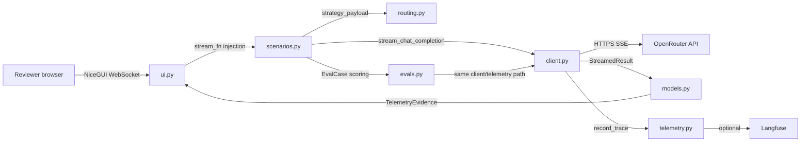

# Architecture

The demo is a single Python package with clear internal boundaries. NiceGUI is the local browser UI; FastAPI exists only as NiceGUI's internal implementation detail and is not a product layer.

## Component Boundaries

| Component | Responsibility | Communicates With |
|-----------|----------------|-------------------|
| `app.py` | Thin startup entrypoint | `ui.py`, configuration |
| `config.py` | Environment variables and defaults | client, telemetry, UI setup states |
| `routing.py` | Named routing strategies and provider preferences | scenarios, client, tests |
| `client.py` | OpenRouter request construction, streaming parse, errors, metadata | routing, telemetry, scenarios |
| `models.py` | Typed run, fallback, telemetry, and eval structures | all internal modules |
| `telemetry.py` | Normalized runtime evidence and optional Langfuse traces | client, evals, UI |
| `scenarios.py` | Default, cost, latency, fallback, repeat/cache, eval scenario orchestration | routing, client, telemetry |
| `evals.py` | Eval cases and deterministic scoring | client, telemetry, CLI |
| `ui.py` | NiceGUI layout, controls, streaming display, run history | scenarios, models |

## Data Flow

1. User selects a scenario and routing strategy in the NiceGUI UI.
2. UI validates prompt and credentials, then starts an async run.
3. Scenario builds a request using `routing.py` and sends it through `client.py`.
4. Client streams chunks and surfaces partial text, usage, router metadata, and errors.
5. Telemetry records observed latency, model/provider, cost/tokens when available, fallback status, cache/repeat state, and trace state.
6. UI updates the response panel and run history as evidence arrives.
7. Eval command reuses the same client/telemetry path, then scores deterministic cases.

## Patterns to Follow

### Async UI Without Blocking

NiceGUI supports async handlers and background tasks. Long-running or streaming work should not block the UI event loop; use async OpenRouter calls or NiceGUI background tasks.

### Router Metadata Opt-In

Send `X-OpenRouter-Metadata: enabled` where useful. Current OpenRouter docs say successful responses can include `openrouter_metadata`, and streaming responses deliver it on the final chunk before completion. Cache hits intentionally do not include router metadata.

### Honest Missing Data

Normalize unavailable provider metadata to explicit unavailable states. Never coerce missing token, cost, provider, router, or cache data to zero.

### Optional Observability

Initialize Langfuse only when credentials are available. Use generation observations for LLM calls, attach usage and cost details when available, score eval results when tracing is enabled, and flush in short-lived commands.

## Anti-Patterns to Avoid

### Hiding OpenRouter Behind Another Router

The demo exists to show OpenRouter behavior. Extra routing abstractions should not obscure the request body, provider preferences, fallback settings, or metadata.

### Silent Fallback

If fallback succeeds, preserve the failed primary attempt. A generic success message erases the reliability story.

### Blocking the NiceGUI Event Loop

Avoid synchronous network calls inside async UI handlers. Use async HTTP or explicit I/O offloading.

### Treating FastAPI as a Product Layer

NiceGUI uses FastAPI internally, but the repo should not present a separate API service architecture.
